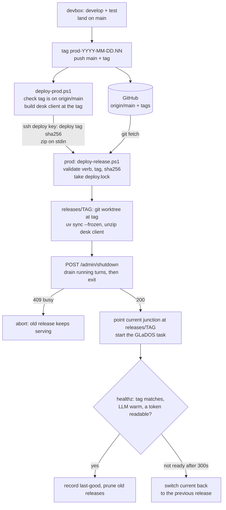

# Deploying GLaDOS: devbox and prod

Two machines run GLaDOS at the same time, independently:

- **devbox** - where features are built and tested. Runs from a normal
  checkout, as today (`glados-start`), against its own local Ollama.
- **prod** - always on, serves the rooms. Runs only **tagged releases**, each
  against prod's own local Ollama. Nothing is edited on prod.

Code reaches prod only through git: a release is an annotated tag on a commit
already on `origin/main`. The one build artifact (the desk web client) is built
on the devbox from a clean checkout of that tag and piped to prod over SSH.



## Prod layout

Everything lives under one root on prod (`<root>`, chosen at bootstrap):

| Path | What | Written by |
|---|---|---|
| `bin\` | `deploy-release.ps1`, `run-glados.ps1`, `bootstrap.ps1` | deploy (refreshed from each good release) |
| `repo\` | clone used only to fetch and to host release worktrees | deploy |
| `releases\<tag>\` | one checkout + `.venv` + desk client per release | deploy |
| `current` | junction to the live release | deploy |
| `local\` | `glados.local.toml`, `rooms.local.toml`, `servers.toml` | you, once |
| `tls\` | this box's cert and key | bootstrap |
| `state\traces\` | traces and room history (forward-only across releases) | GLaDOS |
| `logs\` | `glados.log` and `stdout.log` | GLaDOS |
| `dunnes\<sha>\`, `dunnes\current` | Dunnes MCP server builds | deploy |
| `secrets\` | Dunnes browser profile | the Dunnes server |

Only administrators write code or config; the service account reads the
release and writes only `state`, `logs`, caches and `secrets`.

## Per-machine configuration

The tracked `configs/*.toml` are shared. A machine changes them only through
gitignored overlays, read from `$GLADOS_LOCAL_CONFIG_DIR` (default: next to
the tracked files):

- `glados.local.toml` and `rooms.local.toml` merge over the tracked file of
  the same stem: tables merge key by key, **arrays append**, other values
  replace. An overlay cannot remove a tracked array entry.
- `servers.toml` is read from the same directory.

Prod's `run-glados.ps1` sets the rest from `<root>`: bind `0.0.0.0`, TLS,
log dir, caches, and `GLADOS_OLLAMA_AUTOSTART=0` so GLaDOS waits for prod's
Ollama service instead of launching a second Ollama.

Clients split by box: room devices and `prod-desk-ui` (a browser desk for
talking to prod, at `https://<prod>:8765/`) use prod; `desk-ui` and
`desk2-ui` stay on the devbox. A client's token lives only in the keyring of
the box it talks to.

## Releasing

```powershell
git tag -a prod-2026-09-27.01 -m "<what changed>"
git push origin main prod-2026-09-27.01
.\scripts\deploy-prod.ps1 -Tag prod-2026-09-27.01
```

`NN` is a two-digit counter per day, so tags sort by name. Other verbs:
`-Status`, `-Rollback` (to the newest older release still built),
`-Restart` (drain and restart), `-Dunnes <DunnesStoresMCP checkout>`.

A deploy never kills a server that may be mid-turn. If a turn is still running
after 120 s (a turn held on a confirmation can wait that long), the deploy
aborts with nothing changed; run it again.

**Ollama version is pinned, and the same on both boxes (0.23.2).** It is
part of the model surface: Ollama 0.34 strips Ministral's `[TOOL_CALLS]` /
`[ARGS]` marker tokens from the reply, so the text tool parser never fires
and every tool call is spoken instead of run. Upgrading means moving to
Ollama's native tool-call parsing first, with a bake-off on both boxes;
never upgrade one box alone. After any Ollama or GPU-driver change on prod,
check the first `inference compute` log line names the intended GPU: the
Vulkan device index is not stable across Ollama versions.

**Model gate:** a release that changes anything measured against the model
(prompts, tool descriptions, dispatch) is not done until the bake-off has run
on prod too. Prod's runtime (Vulkan on a different GPU) is its own live
model surface.

## First-time setup

1. Create a standard (non-admin) local user for the service, with a password
   (default name `glados-svc`).
2. Install `uv` and the .NET 10 runtime on prod; rebind prod's Ollama to
   `127.0.0.1` (nothing needs it on the LAN).
3. As an administrator on prod:
   `bootstrap.ps1 -Root <root> -HostNames <name>,<ip> -DeployKeyFile <pub>`,
   then again interactively with `-RegisterTask` (prompts for the service
   password).
4. Build the model on prod:
   `ollama create ministral3:8b-instruct -f configs\ministral3-8b-instruct.Modelfile`.
5. On the devbox, add an `~/.ssh/config` host that uses the deploy key, set
   `GLADOS_PROD_SSH_HOST` to it, ship the Dunnes build (`-Dunnes`), then the
   first tag. That first deploy builds the release but reports "not ready":
   no client token exists yet.
6. Put each prod client's token in `<root>\secrets\<client-id>.token` and
   store it **as the service account**, so the service can read it:
   `runas /user:glados-svc "powershell -NoProfile -ExecutionPolicy Bypass -File <root>\bin\set-client-auth.ps1 -ClientId prod-desk-ui"`.
   It reads back what it stored. Do not use the interactive
   `glados.secrets set` prompt here: its input is hidden and unconfirmed, and
   a console paste can be stored as a control character. Then deploy the
   same tag again (it reuses the build).
7. Log into Dunnes once as the service account (the task has no desktop, so
   `bootstrap_login`'s window can never be seen there):
   `runas /user:glados-svc "powershell -NoProfile -ExecutionPolicy Bypass -File <root>\bin\dunnes-login.ps1"`,
   log in, close Edge, then stop the Edge background processes left running
   as the service account before GLaDOS opens the profile.
