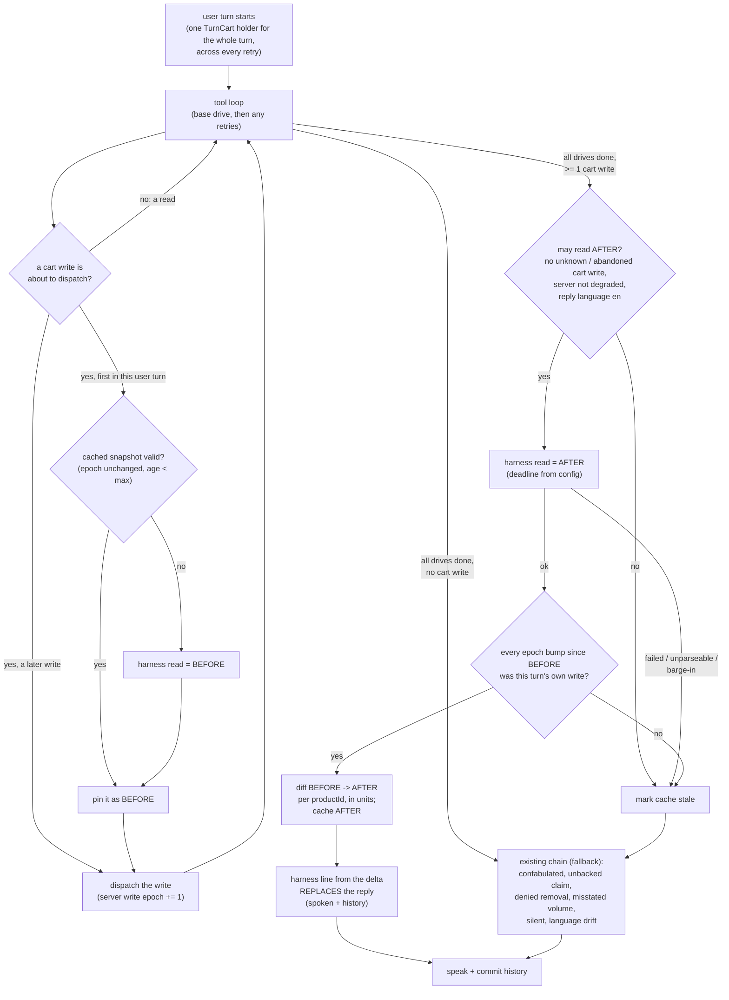

# DESIGN - say what the cart actually did

Status: PLAN, reviewed by the design panel 06-10-2026 (architect, security,
concurrency/QA, clean-slate), findings folded in. Awaiting sign-off. Nothing
here is built.

## The problem

Every reply check in `core/turn_outcome.py` compares the model's reply against
what the tools SAID they did, with English cue tables. None of them sees the
cart. Prod bake-off T13 (29-09-2026, run g): the cart held three milks, "Take
one of the milks off" ran `remove_from_cart` (the whole line), the cart was
EMPTY, and the reply was "Two 3-litre milks remain" -- classified `done`.
Variants: a guard refuses the removal, or the call fails, and the reply still
reports what remains.

Every failure in that family -- "Eggs added" with no add, "Milk removed" after
only a view, "Cart was empty" after a removal, misstated litres, "two remain"
-- has one root: the model narrating cart state it does not have. Each check
so far caught one wording, and the next wording was a new miss (12-09-2026,
29-09-2026, now this).

## The decision

On a cart-write turn whose real change could be read, **GLaDOS speaks a line
the harness writes from the cart diff, and not the model's reply** (user,
06-10-2026: harness-authored, template-only). The model still chooses tools
and arguments; it no longer narrates the cart. The cue-table checks stay, as
the fallback whenever no verified diff exists.

Rejected: using the diff to JUDGE the model's reply with more cue tables (the
first draft of this doc). It keeps the miss-per-wording failure and leaves adds
unchecked. Rejected: a background verify after speaking (speaks the false
reply first, races the next turn). Rejected: reconciling only at session end
(the false reply is spoken and enters history long before).

## Measured cost

Prod traces (49 files, read 06-10-2026): `dunnes.view_cart` n=150, median
1.71 s, p90 2.01 s, max 3.1 s. Writes on the same box: `remove_from_cart`
median 2.85 s, `add_to_cart_by_name` 6.35 s, `add_by_volume` 11.6 s. One
blocking read per cart-write turn (+~2 s); a cold or stale cache adds one more
before the first write.

## The shape

## Components

- **`core/cart_verify.py`** -- pure functions, no I/O.
  - `CartSnapshot.parse(raw: str) -> CartSnapshot | None`. Strict, because the
    content is the shop's (ARCHITECTURE section 7). Reject before parsing if
    the raw text is over 64 KB. `json.loads` with NaN/Infinity rejected
    (`parse_constant` raises); `RecursionError` and every other failure ->
    `None`. Top level must be an object whose `lines` is a list of at most 100
    objects. `productId`: str, `re.fullmatch(r"[0-9]{1,12}", s, re.ASCII)`.
    `quantity`: `type(x) is int` (rejects bool, float, str), 0..999. `packOf`:
    absent or `type(x) is int`, 1..99. Duplicate ids -> `None`. Never a
    partial snapshot. Product names are not kept.
  - `diff(before, after) -> CartDelta`: per productId, units before and after,
    packOf. Kinds: ADDED (new line), RAISED, LOWERED, GONE (line absent after).
  - `cart_line(delta, attribution) -> str | None`: the spoken line (below).
- **`core/cart_verifier.py`** -- `CartVerifier`, held by the organizer and
  injected like the other collaborators; it wraps the registry. Owns the
  snapshot cache, the per-server write epoch, the two reads, the deadline and
  the trace events. Keeps `organizer.py` (3000+ lines) from owning more.
- **Organizer** -- creates one `TurnCart` per USER turn (not per `_drive`:
  scope fallback, escalation and finish-the-job each mint a fresh
  `TurnRecord`, organizer.py:1502/1513/1530/1853). `_run_tool_calls` asks the
  verifier for BEFORE before the first cart write of the user turn and records
  every cart-write call of every attempt on the `TurnCart`. After the last
  drive, the turn handler asks for one AFTER, then speaks the line ahead of
  the existing chain (~organizer.py:1540).
- **Config.** `servers.toml` overlay names a server's cart read (`cart_read =
  "view_cart"`); its writes are the tools already flagged `mutating` there.
  `glados.toml`: `[cart_verify] enabled`, `read_timeout_s` (default 5),
  `cache_max_age_s` (default 600). A server without `cart_read` is never
  verified.
- **Contract.** Any `cart_read` server must return the JSON shape above
  (`lines[{productId, quantity in units, packOf?}]`). That is a contract,
  stated in this doc and in the overlay's comment; a server that does not meet
  it fails parse and is simply never verified.

## The snapshot cache and the write epoch

Rooms run in parallel (one worker per room) and share ONE Dunnes cart, and
GLaDOS holds no per-server call lock. So:

- **Write epoch, per server.** `CartVerifier` bumps it at the registry
  dispatch boundary for EVERY mutating call to that server -- any room, any
  turn, harness or model -- and records which `TurnCart` caused each bump.
- **In-flight count, per server.** The epoch moves when a write is SENT; a
  write sent before a read can land inside it without moving the epoch again
  (code duck, 06-10-2026). So every write also counts as in flight until its
  dispatch returns, raises or is cancelled, and a read -- harness or model --
  is trusted and cached only if nothing was in flight at its start or end.
- **The turn record is a context variable** (`_TURN_CART`), not a dict keyed
  by session: a superseded turn finishing its last write must not count it
  into its successor's record. A write whose dispatch raises or is cancelled
  makes its turn unsafe (outcome unknown).
- **A verdict needs a clean window.** Between BEFORE and AFTER, every bump
  must belong to this user turn. Otherwise another room wrote into the window:
  no line, cache dropped, existing chain decides.
- **Caching a read.** A read (harness or the model's own `view_cart`) is
  cached only if the epoch did not move between its dispatch and its
  completion. The model's `view_cart` is parsed from the RAW typed result at
  the tool_result recording (~organizer.py:2968), before any
  `clamp_result_bytes` cut or reader digest.
- **Validity as BEFORE:** epoch unchanged since the read AND age under
  `cache_max_age_s`, measured from read completion on the monotonic clock.
  The 10-minute default is a guess, not a measurement.
- In memory only; a restart starts cold.

## When no line is spoken (fall back to the existing chain)

- `cart_verify.enabled` is off, or the server has no `cart_read`.
- The turn has a cart write that is indeterminate (timed out) or in the
  abandoned-call map, or the server is degraded (DESIGN-dispatch-cancellation):
  the write may still land after the read, so "nothing changed" could be a
  confident lie. The read is skipped, which also avoids queueing it behind an
  abandoned call in the one-browser server. Cache marked stale.
- The AFTER read fails, times out, or does not parse. Cache dropped. The timeout
  error names the operation ("cart AFTER read for dunnes after 5s").
- Barge-in during either read: cancellation propagates (ARCHITECTURE section
  6), cache marked stale, nothing spoken by this path.
- The epoch window is not clean (another room wrote).
- Reply language is not English (`_cues_readable()` false): templates are
  English for now.
- `confabulated` still wins: it is decided before this and short-circuits.

A `failed` turn with a verified diff still gets the cart line -- that is the
refused-removal-then-"two remain" shape. The model's account of the error is
dropped with the rest of its reply; the line plus a kept closing question is
what the user hears. The outcome stays `failed` for escalation.

A harness read that hits `read_timeout_s` is cancelled, which leaves the stdio
server degraded (abandoned call) until that read answers -- a later model
write fails fast meanwhile. Accepted: a read slower than 5 s means the server
is already struggling, and a read-only call carries no indeterminate outcome.
Both reads are timed in the trace (`cart_verified` / `cart_verify_skipped`,
`elapsed_ms`).

## The spoken line

Built ONLY from bounded integers in the delta and attribution words. An
attribution word is the `query`/`name` argument of the cart-write call that
touched that productId, and must pass `_plain_subject` (`^[a-z][a-z '-]{0,39}$`,
turn_outcome.py:595): the model writes that argument after reading shop text,
so it is bounded like everything else spoken. Never a shop product name.

- **Attribution.** A productId is attributed to a call when the call's
  arguments carry that productId, or when exactly one cart-write call of the
  turn touched the cart. Unattributed lines are described by direction and
  count only ("Took one item out of your cart.", "Added two other items to
  your cart."). A word that fails `_plain_subject` is never spoken and its
  line counts as unattributed -- not "no line": on prod the model often passes
  a full shop product name as the word ("Dunnes Stores Irish Low Fat Milk
  3L", prod traces 06-10-2026), and dropping the whole line for that would
  hand T13 back to the cue tables. Nothing model-written is spoken either way.
  T13 itself (`remove_from_cart(productId)`, no word) is "Took one item out
  of your cart."
- **Counts.** Units, and packs only when `packOf` divides units exactly
  ("12 eggs" or "two packs of 6"); otherwise units.
- **Shapes** (one sentence per changed line, at most three, then a count):
  - ADDED / RAISED: "Added {n} {word}." -- for a volume add with a typed
    `LandedQuantity` in the final drive's record, the existing litres line
    (`_misstated_volume_reply`) replaces that word's sentence.
  - LOWERED: "Took {n} {word} off."
  - GONE: "Took the {word} out."
  - No "entirely" and no "N left": another line of the same word may sit in
    the cart untouched, unattributed and outside the diff, so only the change
    to the touched line is provable (code duck, 06-10-2026).
  - **Empty delta** (writes ran, nothing changed): "Nothing in your cart
    changed." If the model's reply ends on a question, its LAST sentence is
    appended (at most 160 characters, else dropped -- it is model text) -- a clarifying question ("which milk did you mean?") must
    survive; the rest of the reply, which is where "two remain" lives, does
    not.
- Persona: the templates are the first draft; a GLaDOS-voiced variant set is
  part of the bake-off (below).
- Outcome classification is untouched: the line only changes what is said and
  committed.

## Trust and privacy

- The harness reads' raw text never reaches the model, the reader,
  `_wrap_external`, history, `product_names` learning or precedent learning.
  Traces record productIds, integers and the verdict only -- cart contents are
  personal data (ARCHITECTURE section 9).
- Accepted: a compromised server can make GLaDOS state a wrong count (integers
  0..999, the call's own word), or claim nothing changed by replaying the old
  snapshot. Not a privilege gain; the checkout reconcile (next slice) gates
  money on the desk-client confirm screen, never on a spoken line.
- Accepted: one cache per cart account, so a line in room B can reflect counts
  room A produced. Correct for one household; not keyed by room on purpose.
- Accepted: a change made on the Dunnes website itself is invisible until a
  write or the max age makes the cache stale.

## Effect on existing invariants

- Invariant 3 (DESIGN-turn-outcome-guards.md) gains a second typed-quantity
  exception, updated in the same slice: a number may be SPOKEN from a typed
  field of a harness cart read in the same turn, bound to exactly one changed
  line. (Nothing judges the model's numbers here; it is the harness's own.)
- Invariant 1 (fail open) holds: every doubt routes to the existing chain.
- Later, not v1: once this has run on prod, `denied_a_removal_that_landed` and
  most of `misstated_landed_volume` are redundant whenever a delta exists; they
  stay as fallbacks. A delta could also settle an indeterminate write in the
  ledger.

## Latency check before shipping

+~2 s per cart-write turn, ~4 s on a cold cache. Check against the desk
client's silence handling and the bake-off's turn-end watchdog (d4d72f9)
before deploy; if either trips, emit the existing thinking cue during the read.

## Tests (each pins one failure)

1. Room B write between A's BEFORE and AFTER -> no line, cache dropped.
2. Timed-out cart write -> no AFTER read, no "nothing changed", cache stale.
3. Epoch bump during the AFTER read -> result not cached.
4. Degraded server / abandoned call in flight -> AFTER skipped, chain decides.
5. Barge-in mid-read -> read cancelled, cache stale, nothing spoken by this path.
6. Escalation retry -> exactly one BEFORE and one AFTER per user turn; the line
   attributes from every attempt's calls.
7. Cold start -> one pre-read; the next turn reuses the cache, zero pre-reads.
8. Oversized / NaN / bool quantity / float / unicode-digit id / duplicate id /
   non-list lines -> parse `None`, never partial.
9. Read error or timeout -> the existing chain's output byte-for-byte unchanged.
10. T13 replay: GONE line + "Two milks remain" -> "Took one item out of your cart.",
    outcome stays `done`.
11. Refused removal + "Two remain" -> "Nothing in your cart changed."
12. Empty delta + reply ending "Which milk did you mean?" -> line + that question.
13. `confabulated` still wins over a cart line.
14. Model `view_cart` before another room's write -> not used as BEFORE.
15. Attribution word failing `_plain_subject` -> no line, chain decides.
16. packOf not dividing units -> spoken in units, never a rounded pack figure.
17. Harness-read raw text absent from history, reader input and traces.

Plus a prod bake-off: the 17-test suite with `enabled` on and off, scoring
whether each spoken cart line is true and whether it sounds like GLaDOS.

## Not this slice

**Session reconcile before checkout** (agreed 06-10-2026, separate slice):
read the real cart before the checkout confirm and show any difference from
what the session believes on the desk-client confirm screen. Reuses
`CartSnapshot` and `CartVerifier`.
