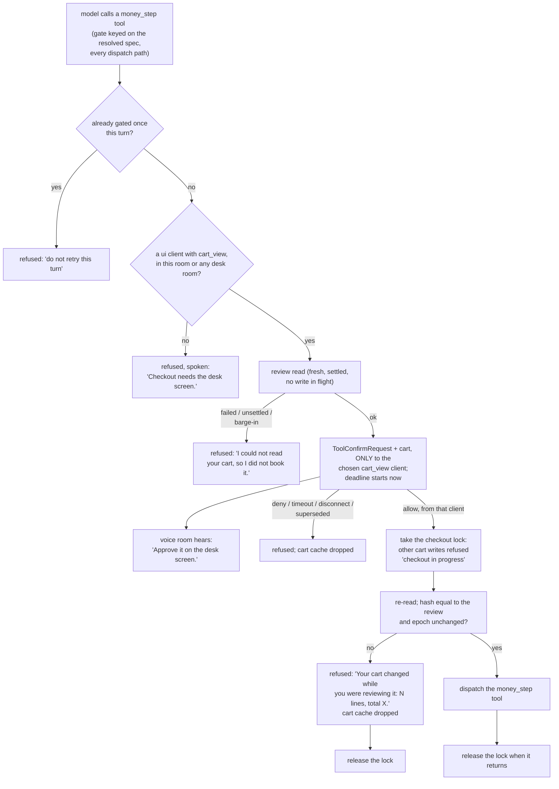

# DESIGN - show the real cart before checkout

Status: BUILT 06-10-2026 (signed off the same day after a 3-seat design
panel; code duck passed, findings below). Follows DESIGN-cart-verify.md and
reuses its `CartVerifier`.

Deviations decided while building:
- `cart_view` counts only when rooms.toml grants it AND the hello declares
  it; granting a capability to a non-ui client fails config load.
- "Desk room" is any room with a connected cart_view client -- no rooms.toml
  desk marker.
- `totals_consistent` (test 14) omitted: view_cart lines carry no prices.
- Refusals reach the user through the model, as fixed tool-result text ending
  "do not call it again this turn", not as harness-spoken lines. Each refusal
  says why (denied, timed out, superseded, screen disconnected, no total).
- A cart whose read reports neither `orderValue` nor `estimatedTotal` is
  refused before any modal: the digest would bind quantities only.
- The startup check covers every server, not only cart_read ones.
- A cancelled turn sends `tool_confirm_resolved` with `via = "cancelled"`, so
  no live Allow button is left on the screen.

Known follow-ups (code duck, not fixed in v1):
- `KNOWN_MONEY_TOOLS` matches the exact name `set_delivery_slot`; a renamed or
  new money tool on the Dunnes server passes the startup check ungated.
- If `set_delivery_slot` itself times out (indeterminate), the checkout lock
  is released while the booking may still land.
- A money step in room B silently supersedes room A's; room A is not told.

## The problem

The per-turn cart check makes each spoken cart line true, but nothing checks
the cart as a whole where money moves. The last automated step is
`dunnes.set_delivery_slot` -- after it the user pays -- and it is **ungated**
(`mutating = true`, no confirmation; servers.example.toml). By then the cart
is the sum of many turns, anything changed on the Dunnes website or app, and
other rooms' turns. Nobody looks at the total before the slot is booked.

Payment is manual in the Dunnes browser today, but that browser is going
headless (project memory, 11-09-2026): nothing may rely on the user seeing the
shop's page. GLaDOS' confirm UI is the only human gate.

## The decision

The last automated step before money (`money_step` overlay flag; today only
`set_delivery_slot`) is confirmed on a **screen**, showing the **real cart**
the harness read at that moment, and the approval is bound to that cart: it is
read again on Allow and must be identical, and no cart write can slip in
between that check and the booking.

A voice-only room may ask for it: the confirmation goes to a desk screen and
the room hears "Approve it on the desk screen." (user, 06-10-2026). Consent
still happens where the cart can be seen.

Cut from v1 (all three seats): per-line "changed outside GLaDOS" marks. They
need a last-seen state that survives epoch moves and restarts, which does not
exist; the Allow-time re-read covers the real risk.

## The shape

## Components

- **Overlay flag `money_step = true`** on `set_delivery_slot` (servers.toml).
  It implies `requires_confirmation`. Named for its meaning, not the tool: a
  future "place order" tool gets the same flag.
- **Fail closed on config.** At startup, a server that declares `cart_read`
  and exposes a tool whose name is on a code-side list of known money tools
  (`set_delivery_slot` today) without `money_step` refuses to register the
  server (logged, named). A missing overlay line must not silently un-gate the
  step that books money. `money_step` on a server without `cart_read` also
  refuses startup.
- **Gate placement.** Checked per request inside `_await_confirmation`, keyed
  on the spec resolved from the call (`self.mcp.spec_for`), so text-parsed
  calls, replays and every other dispatch path reach it -- not on the string
  the model emitted.
- **Client capabilities.** `Hello` gains `capabilities: list[str] = []`
  (protocols.py; old clients send nothing). `cart_view` is honoured only from
  an authenticated `ui` connection. This starts ARCHITECTURE section 13's v7
  move from role-as-capability to declared capabilities, deliberately small:
  one capability, one helper (`_clients_with_capability`).
- **Routing.** The request goes ONLY to one chosen `cart_view` client: one in
  the originating room if any, else one in a desk room (rooms.toml marks which
  rooms are desks). The response is accepted only from that client_id; any
  other client's answer, any voice "yes", and any client without `cart_view`
  are ignored. A reconnect does not rebind it: the request is denied
  ("Connection drops" in DESIGN-confirm-modal.md). The originating voice room
  hears "Approve it on the desk screen."
- **`CartReview`** -- its own display-only module (`core/cart_review.py`),
  apart from the speech-path `CartSnapshot`. Strict parse of the same
  `view_cart` JSON, same 64 KB cap and all-or-nothing rule: per line
  productId, quantity, packOf, `name` clipped to 120 code points AND 60
  graphemes; `orderValue` / `estimatedTotal` as `Decimal` (0..10000, 2 dp),
  sent as STRINGS; `itemCount`. A canonical hash over (productId, quantity,
  packOf) per line plus the totals binds the approval.
- **Protocol.** `ToolConfirmRequest.cart: CartReviewPayload | None = None`
  beside `arg_names`. Payload = lines, line count, totals as strings, and
  `totals_consistent: bool` (shop total vs the sum of line prices when the
  read carries them; else absent).

### The modal (desk client)

- All chrome is the client's own template, filled only from typed fields:
  the heading "Cart at checkout", the line count ("12 lines"), the total
  footer, the column labels. The shop's NAME cell is the only free text.
- Each name is its own isolated cell, `textContent` only, the existing escaping
  and invisible-character rules (DESIGN-confirm-modal.md "Rendering untrusted
  arguments"), styled and labelled "from the shop". Fixed minimum row height,
  no hidden rows; the line count makes a smuggled or missing row visible.
- The total is a fixed footer outside the scrolling body, so no name can sit
  beside it. A `totals_consistent = false` shows a warning in chrome.
- The model's own arguments (slot id/time) stay in their separately labelled
  "arguments (from the model)" block.
- The payload is removed from the DOM on resolve, timeout or close.

### Concurrency

- **Deadline starts after the review read**, so a slow read never eats the
  user's 30 s.
- **Checkout lock, per cart account**, taken on Allow and held from the re-read
  through the money_step dispatch until it returns (up to its 400 s timeout).
  While held, every other cart write to that server is refused with
  "checkout in progress" before dispatch -- so nothing lands between the
  re-check and the booking, nor while the slot is being booked. Reads still
  run.
- **The review read** goes through `CartVerifier`'s read path: on timeout or
  barge-in the money_step is refused and NOT dispatched. A timed-out read
  leaves the server busy until it answers (as in DESIGN-cart-verify.md); the
  re-read on Allow then fails fast and refuses -- never books on a guess.
- **Newest wins**: a second money_step request supersedes the first, which
  counts as a deny with nothing dispatched and its bound hash discarded.
- **One gated attempt per user turn.** Any refusal returns a fixed tool
  result to the model ("The user must ask again; do not retry this turn.")
  and a second call in the same turn is refused without a modal.

### What is said

Refusals are harness lines with no shop text: counts and the total from the
typed fields only ("Your cart changed while you were reviewing it: it now has
12 lines, total EUR 54.20."). A deny uses the existing "user denied" wording.

## Residual risk, stated

- Between the Allow re-read and the booking, a change made on the Dunnes
  website or app is invisible: the lock stops GLaDOS' own writes only. The
  window is one tool call.
- A compromised shop server controls what the table shows. The chrome cannot
  be forged and the totals cross-check flags an inconsistent total, but a
  consistent lie is shown as the truth. Payment remains a separate manual step
  today.

## Not this slice

- A user-callable "check my cart" tool (the model has `view_cart`).
- Price checks against history (`get_price_stats`).
- Gating `list_delivery_slots`: it books nothing.
- Per-line outside-change marks (above).

## Tests

1. Voice-only room asks -> the desk client gets the modal, the room hears
   "Approve it on the desk screen."; no cart_view client anywhere -> refused.
2. Answer from a client other than the chosen one, or a voice "yes" -> ignored.
3. Hello `cart_view` from a non-ui or unauthenticated connection -> not honoured.
4. Review read fails / write in flight / barge-in -> refused, nothing dispatched.
5. Website change during review (fake view_cart differs on its two reads) ->
   refused, cache dropped.
6. Another room's cart write while the lock is held -> refused before dispatch.
7. Allow with the cart unchanged -> dispatched once; the lock released after.
8. Second money_step call in the same turn -> no second modal.
9. Superseded request and client disconnect -> deny, nothing dispatched.
10. Slow fake read -> the user still gets the full 30 s.
11. Hostile names (bidi, newlines, `Total: EUR 5.00`, 10 KB, combining marks)
    -> clipped, isolated, never in history, traces or the model's messages.
12. Startup with `cart_read` but `set_delivery_slot` lacking `money_step` ->
    the server is refused, loudly.
13. A text-parsed `set_delivery_slot` call is gated like a structured one.
14. Shop total inconsistent with the lines -> `totals_consistent = false`.
