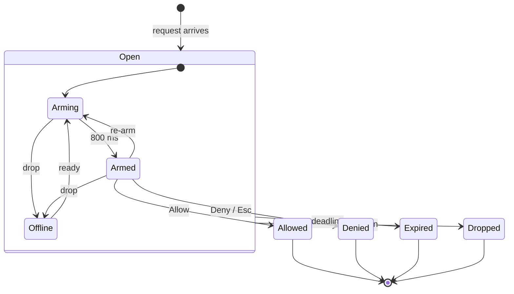

# DESIGN -- the desk client's confirmation modal

## The problem

The desk client answers a `tool_confirm_request` with `window.confirm()`
(`client_web/src/main.ts`, `handleConfirmRequest`). ARCHITECTURE.md (v2, part B)
already calls that a v1 stand-in "to replace with a styled non-blocking modal
when a real gated tool ships". Three things have since made it urgent:

1. **It denies without asking.** Observed 11-09-2026: with the desk tab in the
   background, Chrome returned `false` from `window.confirm()` at once, so a
   legitimate `dunnes.set_cart_quantity` was reported "user denied" on the
   primary and again on the specialist. Nobody saw a dialog.
2. **It is about to be the only human gate.** The Dunnes browser is going
   headless (memory `dunnes-browser-headless-plan`): nobody will watch the shop
   window, so this prompt is the one place a person sees a cart write before it
   happens. It fired twice in a three-turn test on 11-09-2026.
3. **It blocks the page.** A native dialog stops the JS thread: WebSocket frames,
   the transcript and TTS playback all stall while it is open, and it cannot
   show the server's deadline (`ttl_s`, 30 s).

What the server does and keeps doing: `Organizer._await_confirmation`
broadcasts to the originating room, waits `confirm_timeout_s` (starting after
the broadcast completes), treats a timeout as a denial, drops replies from
other rooms and stale `request_id`s (uuid4), and takes the first valid answer.
**A room runs one turn at a time and a turn awaits one confirm at a time**, so
the server never has two live confirms for one room.

The design roster (security; reliability + UX) reviewed a first draft on
11-09-2026. Its findings are folded in below; the two lenses disagreed only on
the backdrop click (resolved: it does nothing).

## The plan

### Shape

Two files, split so the rules can be unit-tested the day the client gets a
test runner (not added here):

- `client_web/src/confirm_state.ts` -- the request lifecycle as plain state:
  the one live request, its deadline, its arming time, its `settled` flag.
  Takes an injectable clock (`performance.now` by default). No DOM.
- `client_web/src/confirm.ts` -- the `<dialog>` view. Reads the state, renders,
  and turns trusted user input into `allow()` / `deny()` calls on it.

`main.ts` feeds it every server frame (not only `tool_confirm_request`) and the
connection state, and supplies a `send` callback.

### One live request, newest wins

There is no queue. Because the server holds at most one confirm per room, an
older request still on screen is almost always dead (answered by another `ui`
client, or expired while a hidden tab's timers were throttled).

- A new `tool_confirm_request` **replaces** any request on screen (the old one
  is noted "dropped -- superseded", nothing sent). A duplicate `request_id` is
  ignored.
- **Any later frame for the same `session_id`** -- `tool_call`, `tool_result`,
  `assistant_delta`, `route_notice`, `turn_outcome`, `done`, `cancelled` -- drops
  it: the turn cannot move on until its confirm is resolved, so it was resolved
  elsewhere. This also closes a second desk tab's dialog after the first tab
  answered.
- A `welcome` for another session drops it. An `error` frame does **not**: no
  error code means the turn moved on, and the desk mic keeps sending audio under
  the dialog, so one short frame (`bad_audio_frame`) would close a confirm the
  server is still waiting on -- the silent denial again (code duck, 11-09-2026).

### Deadline

- Stored as a timestamp: `performance.now()` at receipt + `(ttl_s - 1) * 1000`.
  The 1 s margin sits on top of the server starting its clock after the
  broadcast, so the client always gives up first.
- **Checked when it matters, not only by a timer.** The Allow and Deny handlers
  re-check it before sending; `visibilitychange` and window `focus` re-check it.
  A hidden tab's `setTimeout` can be throttled to once a minute or frozen, and
  a user returning after 40 s must find "timed out", not a live Allow.
- The countdown bar is drawn from the deadline (a CSS animation whose duration
  is the remaining time, restarted on visibility), never by counting ticks.
- On expiry: close, **send nothing**, note "confirmation for <tool> timed out --
  not sent".

### Consent: only a deliberate, armed, trusted action sends

- **Arming.** For 800 ms after the dialog is *seen*, **both** buttons are
  disabled and focus sits on the dialog itself, not on a button. Enter typed
  into the text box a moment earlier then neither allows nor denies. Arming
  restarts whenever the dialog becomes visible and focused (`visibilitychange`
  to visible, window `focus`), when a clipped value is expanded, when the
  connection returns to `ready`, and on resize -- anything that moves the
  buttons or brings the page back. A dialog opened in a hidden tab is therefore
  never already armed when the user switches to it.
- **What counts as a press.** Allow grants only when `pointerdown` *and*
  `click` both land on it after the arming time and `event.isTrusted` is true.
  Keyboard activation needs a keydown after arming, with `e.repeat` false, on
  the same button the click lands on. Press memory is reset for each request.
  Both buttons are `type="button"`, not inside a `<form method="dialog">`, so
  nothing submits through a default button and `returnValue` is never read.
- **Escape** is a deliberate Deny (the `cancel` event), subject to the same
  after-arming and not-repeat rule.
- **The backdrop does nothing.** A click aimed at a quick prompt that lands on
  the backdrop must not become an answer either way.
- **`close` never sends.** One `settled` flag per request; a response is sent
  only from the Allow, Deny and Escape handlers, at most once. Expiry, drop and
  supersede close the dialog in code and send nothing.
- **Clipped values block Allow.** A value longer than 300 characters is shown
  clipped with "(N more characters)" and an expand control. Allow stays
  disabled until every clipped value has been expanded, and expanding re-arms.
  Real cart arguments are short; this exists so a padded `query` cannot hide
  the real item past the fold.

### Rendering untrusted arguments

`args_summary` is model-authored, and the model may have just read a scraped
page, so every argument is attacker-influenced text.

- **Nothing through `innerHTML`.** Every string enters by `textContent`.
- **Escaped form.** Each value is shown as `JSON.stringify(value)`: strings keep
  their quotes, so a newline shows as `\n` and cannot fake an extra row, and a
  `2` stays distinguishable from `"2"`. Nested objects show as JSON.
- **Invisible characters made visible.** Bidi controls (U+202A-202E,
  U+2066-2069, U+200E/F, U+061C), zero-width characters (U+200B-200D, U+2060,
  U+FEFF), Unicode tag characters (U+E0000-E007F), variation selectors
  (U+FE00-FE0F), interlinear annotation marks (U+FFF9-FFFB), Hangul fillers and
  other control characters are rendered as `\uXXXX` (`\u{XXXXX}` above the BMP).
  Keys are JSON-escaped like values, so a key cannot fake a row either. Each
  cell is `dir="ltr"` with `unicode-bidi: isolate`; clipping counts code
  points, so it never splits a surrogate pair.
- **Layout the arguments cannot move.** The argument list is its own scroll
  region (`max-height`, `overflow: auto`, `overflow-wrap: anywhere`,
  monospace). Deny and Allow sit in a fixed footer outside it, so a huge value
  can never push them off-screen.
- **Labelled as the model's.** The argument block is headed "arguments (from
  the model)" and styled apart from the dialog's own text, so a value reading
  "Deny" or "Allowed" cannot pass for UI. The dialog heading is built only from
  the server-authored `tool` field.

### Connection drops

A reconnect **can** answer the old request: the desk client reconnects with
the same `client_id`, the server rebinds it, and the confirm check compares
only the room. Clearing the dialog on a blip would bring back the silent
denial.

- While the connection is not `ready`, the dialog stays with both buttons
  disabled and a "reconnecting..." line; the deadline keeps running.
- Back to `ready`: re-arm, then the user can answer. (`transport.ts` reports
  `ready` on socket open, just after sending `hello`; the live test checks an
  answer sent in that window is accepted.)
- `transport.send` does not buffer, so nothing queued while offline is replayed.

### The rest of the page while it is open

`showModal()` makes the page inert, including the Stop button. The dialog has
its own **Stop turn** button that sends `interrupt` for the request's session;
the request then drops on the `cancelled` frame (or on its deadline).

### A background tab

- When `document.hidden` is true on arrival, the tab title becomes the generic
  "(!) Confirmation needed" -- no tool name, no arguments (it shows in the
  taskbar and on screen share). The original title is saved once at startup;
  the flash stops on every exit (answered, expired, dropped, superseded) and
  when the tab becomes visible.
- If the page *already* holds notification permission, a `Notification` with
  the generic body "GLaDOS needs a confirmation" is shown. Never the tool or the
  arguments (Windows keeps notification history and may show it on the lock
  screen). Clicking it only focuses the tab; arming then starts, so the click
  cannot be consent. The client never asks for the permission, which means a
  frozen or discarded tab, whose title cannot change, may give no signal at
  all: the server denies after 30 s as it does today, visibly this time.

### After an answer

- The transcript row says what the user did, not what happened: "you allowed
  <tool> -- sent", "you denied <tool> -- sent", "timed out -- not sent",
  "dropped -- the turn moved on". The following `tool_result` is the truth
  (`user denied` or the real result).
- Focus returns to the text input if it is enabled, not to whatever had it
  before the dialog.

## Lifecycle of one request

Edge labels, spelled out:
- **request arrives** -- `tool_confirm_request`; deadline = receipt + `ttl_s` - 1 s.
- **Arming** -- both buttons disabled, focus on the dialog.
- **800 ms** -- seen for 800 ms, and no clipped value left unexpanded.
- **re-arm** -- tab shown, window focus, a value expanded, resize.
- **drop / ready** -- the connection leaves `ready` / returns to it.
- **Allow, Deny / Esc** -- a trusted, armed press before the deadline; sends
  `granted` once.
- **deadline** -- the deadline has passed (checked on every press and on return
  to the tab); sends nothing.
- **moved on** -- a later frame for its session, a newer request, or a
  `welcome` for another session; sends nothing.

## Server-side hardening (proposed with this slice)

Both reviewers found gaps on the server that the modal cannot close. Two are
small enough to ride along; the rest are deferred.

- **Only a `ui` client may answer.** `handle_tool_confirm_response` checks the
  room but not the role, so a mic or speaker token in the room could grant.
  One condition: `binding.role == "ui"`, matching `_room_can_confirm`. A
  dropped device answer does not use up the request.
- **What was approved is what is dispatched.** Today nothing touches `tc.args`
  between the confirm and `mcp.dispatch`, but only by convention (same mutable
  dict, same await chain). Snapshot the args at the confirm and dispatch the
  snapshot, so a future rewrite placed after the confirm cannot silently break
  consent. After a grant the snapshot replaces the call for the rest of the
  loop, so the in-flight and write ledgers record what went to the wire.

Deferred, each its own slice:
- **Escalation re-prompts.** A turn whose only failure is a denied or timed-out
  confirm still escalates, so the specialist asks again for the same call
  (observed 11-09-2026). `_should_escalate` should skip it. Until then the
  second prompt is expected.
- **A `tool_confirm_resolved` broadcast**, so other `ui` clients close their
  dialog on an exact signal instead of the next-session-frame heuristic.
- **Per-user consent across several `ui` clients** (ARCH section 3): today one
  desk tab's Allow authorises another person's utterance in the same room.
- **Scoping the request broadcast to `ui` clients**, so mic and speaker devices
  stop receiving the arguments (ARCH section 9 minimisation).
- **Showing why the call was gated** (always gated, text-parsed, untrusted
  session): needs a protocol field.

## Verification

No client test runner; `npm run typecheck`, then drive it live in the browser
pane against the running server with the gated `toy_stdio.roll_dice` ("Roll
3d6 for me."), checking the trace for each:

1. Allow -> `tool_confirm_response granted=true`; Deny and Escape ->
   `granted=false`.
2. Let it run out -> `tool_confirm_timeout`, no response in the trace.
3. Type in the text box and press Enter as the request arrives -> neither a
   grant nor a deny. Backdrop click -> nothing.
4. Hide the tab for over 30 s after the request arrives, return, click Allow ->
   nothing sent, transcript "timed out".
5. Open with the tab hidden, switch to it, click Allow immediately -> ignored
   (arming restarted).
6. DevTools offline for ~2 s with the dialog open, reconnect, Allow ->
   `granted=true` accepted.
7. Stop turn inside the dialog -> `cancelled`, dialog dropped, nothing sent.
8. A long padded argument -> Allow disabled until expanded.
9. An argument containing a newline, U+202E and a zero-width space -> shown
   escaped, one row.
10. Two desk tabs in one room: answer in one, the other's dialog closes on the
    next frame for that session.
11. Server: a confirm response from a non-`ui` binding is dropped (unit test);
    dispatch receives the snapshotted args (unit test).
12. Deny, then observe whether escalation prompts again (documents current
    behaviour; not a pass/fail).
