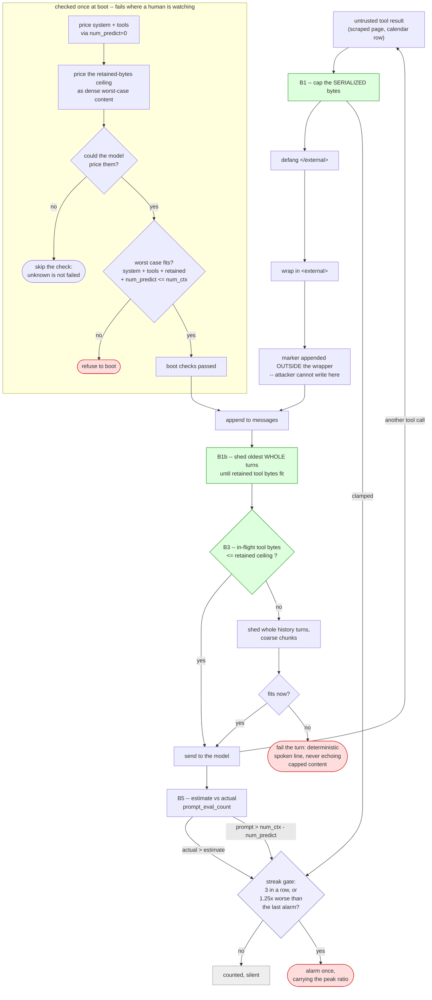

# DESIGN -- T3: context flooding evicts the `<external>` rule

Status: **B1-B5 built; D4 deferred.** Roster run 01-09-2026 (Architect,
Security, Model/Inference-Performance). This document is the *how*; the threat
and the measurements live in `SESSION.md` under T3, and the proof artifact is
`scripts/flood_probe.py` (`bfa419a`).

**One decision in this document was overturned by measurement after the roster
signed off. It is recorded below rather than edited away**, because the reason
it was wrong is the most useful thing here.

## The problem, measured

Ollama's `/api/chat` truncates an over-long prompt **from the front** and reports
nothing. The system prompt sits at the front and carries the section 7
`<external>` rule -- the one telling the model that text inside `<external>` is
data, not commands. A long enough tool result therefore deletes the defence that
governs it.

`flood_probe.py` at `num_ctx=4096`, both shipped-tier models: a control refuses,
ballast that FITS still refuses, ballast at 2x the window complies. ~4.1k tokens
silently dropped against a 44-token system prompt. The FITS arm is what makes
this eviction rather than the attention-dilution effect the public literature
describes.

**What actually leaves the hole open.** A cap already exists --
`tool_payload_cap.cap_tool_payload`, applied at `organizer.py:1855`, and its
output *is* what gets wrapped and sent (the broadcast and trace above it keep the
whole result). But it is **item-count, not bytes**; **opt-in per `ToolSpec`**;
and it **only recognises list-shaped payloads**. A scraped page returning one
giant string is exactly the shape it declines to touch.

## Decisions

**Byte cap is primary -- but a per-result cap alone does NOT bound a session,
and the roster's Security lens was right about that.** The original reasoning
here was that once results are byte-bounded and history is bounded at 8 turns,
the worst case is a static inequality. The arithmetic was fine; the ratio was
assumed rather than measured, and that is where it broke.

Priced against the shipped model, adversarially dense content costs **1.14
bytes per token** -- English prose costs 4.49. So a 4096-byte result is ~3.6k
tokens, and eight retained turns of them is ~29k against a 12288 window. A
per-result cap generous enough to be useful can never satisfy the turn-count
inequality, because turn count cannot bound a session when the size of each
turn is the attacker's to choose.

The fix is the one Security named: a ceiling on the tool bytes RETAINED across
the session, not just per result. The worst case then becomes
`system + tools + retained + num_predict`, independent of turn depth. The
Architect's and Model lens's arguments for avoiding dynamic per-turn shedding
still stand and still hold -- the bound moved, the shedding did not.

**Count tokens by asking the model.** The intended route was a bundled
`tokenizer.json` (`tokenizers` 0.23.1 is already installed via
`faster-whisper`), but no such artifact is available offline for the shipped
model. `POST /api/chat` with `num_predict = 0` prices a prompt exactly, through
the real tokenizer and the real code path, with no artifact to drift out of
step with a swapped model. Its limit is that a too-long prompt saturates at
`num_ctx` -- it can verify a prompt fits but cannot say by how much it
overflows -- which is fine for a boot check and useless for per-turn shedding. A character
estimate is disqualified -- measured 15% low, which is the unsafe direction. A
pure byte bound (`tokens <= utf8 bytes`) is *sound* but unusable as the budget:
at `num_ctx - num_predict = 8192` it would cap the prompt at 8 kB while the
steady-state prompt is already ~4.7k tokens (~19 kB), rejecting every normal
turn. Bytes stay as a cheap pre-filter; the tokenizer makes the decision.

**No silent fallback.** A missing or mismatched tokenizer fails boot. Validated
at warm-up by pricing the real prompt through `/api/chat` with
`num_predict = 0` and comparing to the returned `prompt_eval_count`; a mismatch
beyond a couple of tokens refuses to boot. That turns "the tokenizer must track
the model" into an assertion instead of a hope.

**The truncation marker sits OUTSIDE the wrapper.** The lenses split on this.
Security feared a GLaDOS-authored line an attacker could forge; the Architect
cited the `_INDETERMINATE_NOTE` precedent. Outside wins because the existing
defang means an attacker cannot emit text after the closing tag -- any forgery
lands *inside* the wrapper, where position distinguishes it from the real
marker. A marker inside sits in the region the model is told to ignore, which
defeats its purpose.

**The `num_ctx` floor is derived, not a constant.** Asserted at boot against the
actually-assembled system prompt, so it self-adjusts across model swaps and a
growing tool-schema block. A constant sized for the 8B is a boot failure for
`ministral3:14b` on the same 12 GB card. Framed as a correctness invariant, not
an anti-attacker control: the realistic case is someone lowering `num_ctx` to
fit VRAM and silently disabling a security property.

**Tail repetition is deferred pending measurement.** It costs tokens on every
turn forever, spending the budget it exists to protect, and whether a tail-only
rule governs at all is an open empirical question.

## The defence

| | what | why it is here |
|---|---|---|
| **B1** | Mandatory byte cap on the serialized tool result, before defang and wrap | Closes the measured attack at the source |
| **B1b** | Ceiling on tool bytes retained across history, shed by whole turns | A per-result cap alone does not bound a session |
| **B2** | Boot inequality: worst-case prompt fits the window | Makes B1 + B1b sufficient without runtime shedding |
| **B3** | Per-hop budget assertion inside the tool loop | The prompt grows *between* passes, not just at turn start |
| **B4** | Derived `num_ctx` floor, and `None` forbidden on the ollama backend | `None` hands the window back to Ollama's small default |
| **B5** | Two trace events, alerting on ratio and streak | An alert that fires on every Dunnes page is muted within a week |

Ordering inside B1 is load-bearing and gets a test: **cap the serialized string,
then defang, then wrap.** Capping the wrapped string would drop the closing tag
and manufacture the wrapper escape the defang exists to prevent. The cap is a
parameter of the wrap step so the two cannot be separated by a later refactor.

`num_predict` is never a shed lever. Dropping it to 512 measured 4/22 on
qwen3:4b, and the failure mode is an empty reply that logs as success.

The language-guard repair path (`build_repair_messages`) gets the same cap. It
defangs `</external>` but has no length bound, and its output is spoken *and*
committed to history.

The red terminals are the three ways this design refuses rather than degrades
silently, which is the whole point: today's failure is invisible.

## Independent of the above -- now done

Both items below shipped with B5, in `core/prompt_pressure.py`.

The context-pressure check in both adapters tested `prompt_tokens > 0.8 *
num_ctx` while the real invariant is `prompt_tokens + num_predict <= num_ctx`.
At shipped values that was a **1638-token band** (9830 vs 8192) in which the
coupling is violated and nothing warned. It now judges against the usable
window, `num_ctx - num_predict`, with **no fraction on top** -- and that "two-
line fix" framing was wrong in a way worth recording, because the first attempt
carried the old `0.8` onto the usable window and thereby double-counted the
margin. It breached at 6553 while the boot check certifies ~7500 and passes it,
so the one prompt shape this design is built around would have alarmed on every
send. The invariant breaches at `usable` exactly, and that is already early:
front-truncation does not begin until `num_ctx`, a further `num_predict` away.
The reservation *is* the headroom.

It still reads `prompt_eval_count` off the completed response, so it remains
post-hoc ground truth rather than a budget. That is the correct division of
labour -- B3 prevents, B5 detects -- and both are wanted.

`_CONTEXT_PRESSURE_RATIO` was duplicated verbatim in `ollama.py` and
`llamacpp.py` with divergent warning strings. The judgement now lives in one
module with the adapters supplying numbers, and the wording lives in
`log_alarms` so one condition cannot read as two different problems depending
on which backend is running.

## As built

| | where |
|---|---|
| B1 per-result clamp | `tool_payload_cap.clamp_result_bytes`, applied in `organizer` before defang and wrap |
| B1b retained-history ceiling | `organizer._within_external_budget`, sheds whole turns |
| B2 boot inequality | `core/prompt_budget.py`, called from the lifespan before warm-up |
| B4 explicit window | `LLMConfig` refuses `num_ctx = None` on the ollama backend |
| repair path | `language_guard.build_repair_messages` takes the same clamp |
| B5 alarms | `core/prompt_pressure.py`; adapters own a `PromptEstimator` and yield `LLMUsage`, the organizer owns `SessionPressureMonitors` (keyed by model+session) and a `StreakAlarm` for clamp pressure |

Shipped defaults, priced against `ministral3:8b-instruct`: `max_result_bytes =
2048`, `max_history_external_bytes = 4096`. System prompt 602 tokens, retained
ceiling 3606 tokens, `num_predict` 4096 -- worst case 8304 of 12288, leaving
~3.9k tokens for the tool schema block (last measured at ~3.3k). The margin is
real but not generous, and the tool-block figure is carried from an older
measurement rather than priced here; the boot check prices the live one and
refuses to start if it no longer holds.

B3 shipped as `Organizer._shed_for_hop`, and it asserts the retained-BYTES
ceiling at every send rather than an estimated token count. Re-deriving tokens
per hop would have meant a second estimator with its own constants, disagreeing
with the boot check's measurement in a direction nobody would notice; holding
the byte ceiling the boot check actually priced makes the inequality above true
of every prompt a turn assembles, using the one number that was measured.

**B5 completed 07-09-2026.** Three alarms, all gated the same way.

*Drift* is the half that was open. The boot check proves an inequality about
prompts nobody has assembled yet, and until now the verdict was logged and
dropped, so the proof had no way of ever being contradicted by the prompts
actually sent. `server.py` now hands the priced prefix to the adapter, each send
is estimated before dispatch, and the estimate is compared to the returned
`prompt_eval_count`. The estimate is deliberately not a second tokenizer -- it
is built from the two quantities the boot check already measured, so a
disagreement is a statement *about the boot check* rather than about itself.

The divisor is the density the boot check **achieved** (~1.14 on the shipped
model), not `MAX_CREDIBLE_BYTES_PER_TOKEN`. Estimating at the 1.6 ceiling
predicts ~40% fewer tokens than the check's own measurement of the same content,
so legitimately dense bytes -- base64, minified JSON, source, any multibyte
script -- would price above the estimate with the boot check having been wrong
about nothing. The ceiling stays the fallback for a backend that reports none.

*Streak, not occurrence*, is the second half, and it applies to all three
alarms including the pre-existing `external_result_capped`. A single breach is
recorded and stays silent; three consecutive speak once, carrying the peak
ratio. The trace event stays per-occurrence, because a trace is a record and an
operator reconstructing a turn needs every clamp in it -- what changed is that
it is no longer also the alert.

A streak gate alone would have been the old one-shot latch with a delay bolted
on: the conditions worth alarming on are STANDING conditions, so they never
produce the clean observation that re-arms the gate, and the first draft would
have warned once per process while watching the ratio climb from 1.05x to 5x in
silence. `ESCALATION_FACTOR` re-fires on material escalation, which is what
makes it a gate rather than a latch.

Two estimator omissions were found by review and both pushed the same way --
estimate too low, so `actual > estimate` for reasons that say nothing about
density. `tool_calls` arguments are serialized onto the wire but contributed no
bytes, and *every* system message was skipped rather than only the boot-priced
first one, leaving a harness directive riding with the turn paid for by
nothing. An alarm made noisy by its own arithmetic is the failure the streak
gate exists to prevent, and it would have been the harder one to diagnose.

**The streak is per conversation, and getting there took two attempts.** The
first version kept the monitor on the adapter and documented the consequence
rather than fixing it: one adapter serves every room, so "three consecutive
breaches" could be assembled from three unrelated conversations, and a clean
send in any room re-armed an alarm another room was building toward.

The second attempt moved judgement to the organizer -- correct -- but left the
numbers in a field on the adapter for the organizer to drain. That is wrong for
the same underlying reason, one level down. `room_queues` gives each room its own
worker task and deliberately imposes no extra serialisation, so two `chat()`
calls interleave at every await; a single slot is read by whichever turn reaches
it first. It would have traded a cross-session *streak* bug for a cross-session
*attribution* bug -- rarer, harder to see, and strictly new.

What removes the class of bug rather than the instance is putting the numbers
**in the stream**: `LLMUsage` is an ordinary `LLMEvent` the adapter yields, so
the reading is a per-call local by construction and reaches exactly the caller
that produced it, however the tasks interleave. The lesson worth keeping is that
shared mutable state on a shared adapter cannot express a per-call invariant, no
matter how carefully it is cleared.

Monitors are keyed by `(model, session)`, not session alone, because
`_pick_brain` runs the specialist under the same `session_id` with a different
window -- keying on the session would blend two brains into one streak, the same
defect along the brain axis. Eviction is least-recently-used and bounded, since
insertion order would drop the room running since boot (the busiest, so the
likeliest to be mid-breach) the moment a burst of short-lived sessions arrived.

The router's specialist model is a distinct adapter whose prefix this budget
does not describe, so drift is not monitored there and boot says so out loud;
coupling still runs.

## Before D4 ships

Measure whether a tail rule governs at all, with two arms added to
`flood_probe.py`:

- **Arm E** -- system rule, flood, rule restated after the ballast. The
  realistic shape.
- **Arm F** -- *no system prompt at all*, short prompt that fits, rule only at
  the tail. This is the decisive one: it asks whether a rule with no head copy
  anywhere governs, with no eviction ambiguity to confound it.

If F refuses on both models, tail repetition is real. If F complies while E
refuses, E's refusal was head-copy survival and the defence is hope. Note the
harness's `num_predict <= num_ctx // 4` guard currently refuses production's
4096, so either scope that guard to the calibration phase or record that the
result is at a config GLaDOS does not ship.

## Residual -- state this plainly

**This closes eviction, not persuasion.** An attacker can no longer delete the
rule that governs them. Ordinary indirect prompt injection sized to fit under
the cap -- a 300-byte persuasive product description -- is untouched by every
defence here, and remains exactly the threat section 7 has always carried. The
`<external>` wrapper is honoured by the model's attention, not enforced by code.

The structural upgrade that would change the class of the problem is section 7's
parked **separate reader LLM call** (no tools) to summarise external content
before it reaches the tool-armed planner: it bounds size and severs tool access
in one move. B1-B5 buy time for that; they do not replace it.

On the llama.cpp backend the adapter documents that its `num_ctx` is an
expectation rather than the server's truth (the real window is `llama-server`'s
launch `-c`). B3 cannot make a guarantee there, only a best effort.
