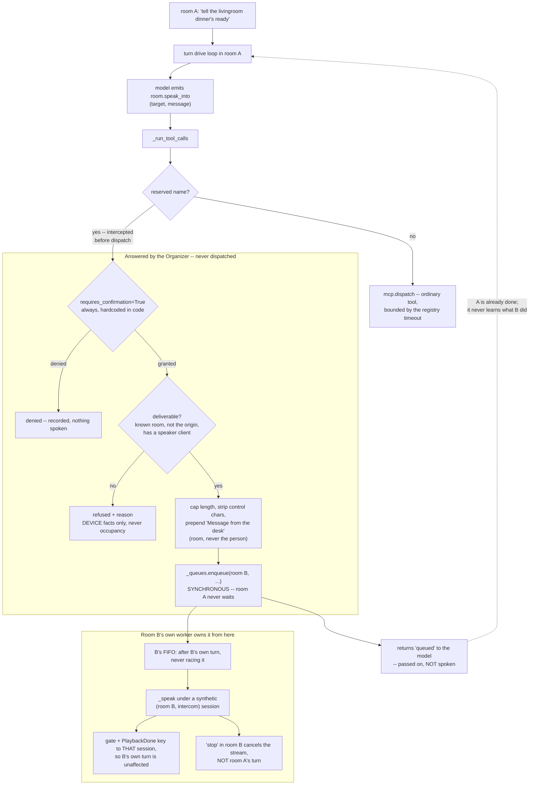

# DESIGN -- speaking into a room you are not in

Status: **designed, not implemented. Awaiting sign-off.** Roster run 28-08-2026
(Architect, Security, Concurrency/Reliability) against the plan below, per the
panel gate `ARCHITECTURE.md` section 13 sets for this feature. All three lenses
rejected part of it, and two of the five parts were replaced outright.

## The problem

A user in room A wants GLaDOS to speak into room B: "tell the livingroom
dinner's ready." Rooms today are `desk`, `desk2` and `livingroom`
(`configs/rooms.toml`).

`ARCHITECTURE.md` section 13 already carries the fit analysis and it is right
about the shape: the egress half exists, because `_speak` and `_broadcast`
already synthesize into an arbitrary `room_id`, and the target room is just a
parameter that today always equals the originating one. What is missing is the
trigger, and the safety around it.

## The plan the roster reviewed

1. An in-process `room.announce` tool holding an Organizer reference, reusing
   `_speak`/`_broadcast`.
2. Allowed rooms pinned as a JSON-schema `enum` from `RoomsConfig`.
3. If room B is busy, queue behind it with a bounded wait; on expiry, refuse.
4. Single household, so no confirmation gate; attribution prefix on the message.
5. A persona line so announcing is in-domain.

Parts 1, 3 and 4 were wrong. Part 3 was wrong in a way that would have rebuilt,
for audio, the exact bug this repo spent 28-08-2026 removing for cart writes.

## What the roster changed

### The tool must not hold the Organizer

`Tool` (`mcp/registry.py`) is a two-member Protocol -- `spec` and `call` -- and
`StdioToolProxy` and `NowTool` satisfy it identically without either knowing what
an Organizer is. A tool holding an Organizer reference inverts the layering and
creates a construction cycle: the registry is built before the Organizer, which
takes `mcp` as a dependency, so it needs a post-hoc `tool.organizer = ...`
setter -- a late-binding mutable back-edge into the most load-bearing object in
the system.

**Decision: split declaration from execution.** A spec-only stub is registered
in the registry, and `_run_tool_calls` intercepts the reserved qualified name and
performs the egress itself, in the same spirit as `_maybe_force_time` reaching
into the tool path from the other direction. `servers/` gains no import of
`core/`, and the Organizer only ever matches a string constant.

This also dissolves what Concurrency read as a contradiction. It objected that
registry-declared means dispatched, and therefore bounded by `dispatch`'s
`asyncio.wait_for` -- true of a dispatched tool, but the interception happens
*before* `mcp.dispatch` is ever called, so no dispatch budget applies. Declaring
the spec is what makes the model able to see it, namespace it, and count it
against the ~30-tool cap; only the side effect stays out of the registry.

**This corrects the ARCH bullet**, which says the trigger "is NOT an MCP tool."
That is right about execution and wrong about declaration, and the plan
inherited the conflation from it. Reword when this lands: *the trigger is a
registry-declared spec the Organizer answers itself, not a dispatched tool.*

### Never wait on room B -- hand the utterance to room B's own queue

`core/room_queues.py` already exists, and its docstring already states the
invariant part 3 was trying to re-derive: "two simultaneous TTS streams to one
room are incoherent regardless of who spoke, so the queue key is `room_id`."
`enqueue` is synchronous.

Waiting was the only dangerous part of part 3, and it is dangerous three ways.
Room B's turn can run tens of seconds against a dispatch budget of 8s, so the
wait expires and the call is now `indeterminate` -- the model told "I do not
know whether the livingroom heard you", which is precisely the state
`DESIGN-dispatch-cancellation.md` exists to eliminate, re-created for a new
effect. Worse, a wait that already handed the text to a queued slot may still
fire later: abandoned work that keeps running, with a speaker instead of a cart.
And it serialises two rooms through one turn, which is what cross-room
parallelism buys.

**Decision: `room.speak_into` returns synchronously, always, in one of three
terminal states -- `queued`, `refused`, or `denied`. Never `unknown`.** If the
room is deliverable, `_queues.enqueue(room_b, ...)` and return `queued`
immediately. "Queue behind B's turn" then costs nothing: B's FIFO puts it after
B's turn by construction, and ownership transfers to B's worker, which is the
correct owner.

The honesty cost is real and is accepted: `queued` is not `spoken`, so the
model must say "I have passed it on to the livingroom", not "I have told them".
Per this repo's own harness-over-prompts lesson that is carried by the tool
result string, not by prompt wording alone.

### The announcement runs under room B's identity, not room A's

`_speak` unconditionally assigns `self._tts_gate[room_id]` a gate keyed to the
*calling* session. Passing room A's session into room B's gate breaks room B four
ways: B's mic is suppressed under a foreign session; B's own `PlaybackDone` is
dropped because `handle_playback_done` matches on `session_id`; the
`_arm_gate_after_send` successor guard no-ops or stomps `earliest_release`
depending on interleaving; and a failure between the provisional horizon and the
`finally` deafens B for the whole `gate_max_s`.

**Decision: the announcement gets its own synthetic session bound to
`(room_b, intercom)`.** Because it also runs *on B's worker*, it is serialised
with B's own turns rather than racing them, which is what actually dissolves the
collision rather than papering it. The synthetic session is what makes the rest
coherent: `_active_session_in_room(room_b)` can find it, so a "stop" spoken in
room B cancels the announcement playing in room B -- which is stopping an egress
stream, not cancelling room A's turn. Those must stay separable, and A learns
about it only through its already-returned `queued`.

### Sound is external state, so the gate is not optional

Part 4 said single household, no gate. Every lens that looked at it disagreed,
and the strongest form of the objection is not about households at all: it is
that `room.speak_into` is reachable from a turn that ingested untrusted content,
and the result is attacker-chosen audio in a room nobody is watching.

The existing arms do not cover it on their own. `outcome.untrusted_seen` only
fires after an `<external>` wrap has happened this turn, and `from_text` only for
text-parsed calls -- so a structured call on a turn that read nothing untrusted
reaches dispatch un-gated. And the injection surface is wider than scraped pages:
STT ingests whatever is audible in room A, including a television or a phone on
speakerphone, and that path never touches `<external>`.

**Decision: `requires_confirmation=True` and `mutating=True`, hardcoded on the
spec in code.** Both are cheap here and `mutating` is separately required for a
second reason: without it a *successful* announcement leaves the turn with no
successful mutating call, so the goal-check classifies an imperative turn as
drifted and the user is told nothing happened.

Note a claim from the Security lens that does not hold, checked against the tree:
it warned the flags would be fail-open through the gitignored `servers.toml`
overlay. `apply_flags` runs only on the stdio registration path; an in-process
spec is code-defined and no overlay can reach it. The recommendation stands and
is simply already free.

"Single household" is an assumption about *occupancy* encoded as a property of
*code*, and it is false the day a guest sleeps in the livingroom or `desk2` has a
different person at it. Today every client in `rooms.toml` carries
`default_user = "qcko"`, so section 3's "permission gates are per-user" is
*vacuously* satisfied and protects nothing the moment a second user appears.
Relaxing the gate stays possible, but as a recorded per-room opt-in rather than a
silent default.

### The confirmation asks the wrong room, and cannot yet ask the right one

`_await_confirmation` takes a single `room_id`, broadcasts there, and drops
replies from anywhere else. So confirming in A means the occupant of B gets no
say and no notice -- section 3's rule applied outside the shape it was written
for, where the effect lands in the initiating room.

**Decision for v1: confirm in the originating room, plus a fixed,
non-model-authored spoken preamble in B naming the origin room.** Confirm-in-B is
the more correct model but needs new plumbing, and half-building it by passing
B's `room_id` into the existing function inherits a trap: that function returns
`False` when the room has no clients, so an announcement into an empty room would
be silently denied rather than delivered.

### Constraints on what is spoken

The message is model-authored from an utterance that may itself have been shaped
by untrusted bytes. `_strip_markdown_for_tts` is a prosody fix, not a sanitiser:
no length bound, no charset bound, no control characters handled. A very long
message holds room B's speaker for minutes, and `gate_max_s` bounds the gate but
not the audio.

**Decision:** cap the message in the Organizer, not only in the JSON schema
(schema `maxLength` is a hint to the model, not an enforced boundary); reject
control characters; build the attribution prefix as plain prose so
`_strip_markdown_for_tts` cannot mangle it. The prefix names the **room, never
the person** -- "Message from the desk" is fine, naming who is at the desk is a
presence disclosure into a room they did not choose to be in. At most one
announcement per target room per turn, so one compromised turn cannot loop.

## The conflicts the roster raised, and how they were settled

**1. Enqueue always, or refuse when B is busy?** Concurrency argued enqueue:
waiting is the only hazard, and the existing per-room FIFO makes queue-behind
free. Security argued refuse-if-busy, because a queue is a buffer an attacker can
fill. Architect wanted refuse-if-busy purely as a smaller first slice.

*Settled: enqueue, bounded.* Security's objection is about unbounded
accumulation, not about queueing, and it is answered by the per-turn cap above
plus a bounded depth per room -- at which point refuse-if-busy costs a real
feature (the common case is announcing into a room that happens to be mid-turn)
and buys nothing the cap does not. Refusal stays for the undeliverable cases.

**2. May the refusal say why?** Security says the tool result must never expose
room B's state -- client list, gate, occupancy -- because announce is the one
direction where the model learns about a room it is not in. Concurrency says an
announcement into a speakerless room currently streams to nobody and returns
success, so the user is told "I have told the livingroom" when nothing happened,
and that must refuse with a distinct reason.

*Settled: deliverability may be disclosed; occupancy and gate state may not.*
"No speaker is configured or connected in that room" is a device fact the user in
A legitimately needs and is the single most likely real-world failure (a Pi
unplugged). "Someone is in there" or "that room is busy" is not disclosed --
which the enqueue decision makes easy, because busy is no longer a refusal.

**3. Does the announcement enter room B's history?** Architect raised it and
noted both answers are defensible but silence is not.

*Settled: egress-only, nothing enters B's session.* Section 3's "no context
bleed" is a session rule, and creating or joining a session in B would break it
structurally rather than by policy. The accepted cost: "what did you just say?"
asked in room B does not work in v1.

## The two slices

**Slice 1 -- the capability.** The spec-only stub with flags hardcoded and a test
pinning them; the interception in `_run_tool_calls`; validation (known room,
target is not the origin, room has a speaker); the synthetic `(room_b, intercom)`
session; enqueue on B's queue; the fixed spoken preamble; the message cap and
per-turn cap; the audit log line (origin room, speaker, target, length, hash,
gated, granted); the persona sentence.

**Slice 2 -- the room's own say.** Confirm-in-B plumbing, per-room
`announce_targets` allowlist and quiet hours in `rooms.toml`, and the per-room
opt-out of confirmation.

## What proves it, and what cannot be proved

Testable against the fakes this repo already has (`tests/test_tts_feedback_gate.py`
for the fake TTS and speaker client, `tests/test_room_queue.py` for cross-room
overlap):

- `speak_into` returns in bounded time while room B's turn is still running --
  the single most valuable test, because it is what stops block-and-wait from
  creeping back in.
- `handle_playback_done` from B's speaker for B's own session is not dropped
  while an announcement's gate is armed.
- "stop" spoken in room B cancels the announcement and does not start a new turn
  in B, and does not cancel room A's session.
- An announcement into a speakerless room returns `refused`, not success.
- Two announcements into one room serialise; chunk sequences do not interleave.
- Room A's history gains the tool result; room B's history gains nothing.
- The spec's flags are what the code says, not what a config says.

Not provable here: whether two overlapping streams are audible as garbage, real
playback timing, and whether a household actually finds the confirmation
tolerable.

## Carried, not designed here

- Interrupting room A mid-announcement leaves chunks already queued on B's
  client, and no cancellation is broadcast to B. Whatever flush the client
  honours must reach the **target** room.
- `_gate_max_s` is now reachable by a new path: an announcement that dies
  deafens room B's mic for that whole window, with nobody in B able to see why.
- Announcing into your own room is rejected in v1. Routing it as ordinary reply
  text would be friendlier, and it also sidesteps `_capped_for_speech`, which is
  worth thinking about before allowing it.
- The intercom is one-way. A reply from room B has no path back to room A.

## The shape

