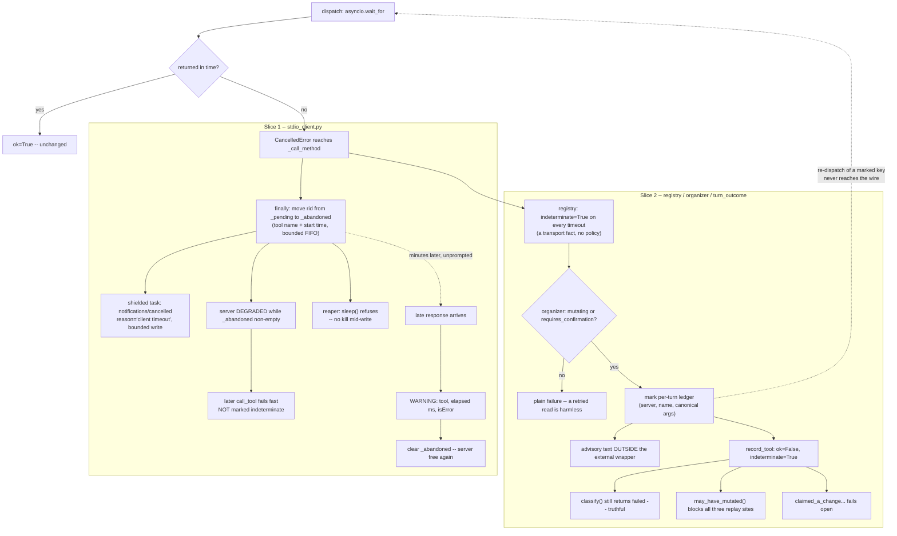

# DESIGN -- a dispatch timeout must stop claiming the write failed

Status: **implemented, except the cancellation send.** Roster run 28-08-2026
(Architect, Security, Concurrency/Reliability) against a four-part plan; two of
those four parts were found to introduce new instances of the bug they targeted,
and the design below is the corrected shape.

Slice 1 landed 28-08-2026 in `src/glados/mcp/stdio_client.py`: the `finally`
that stops leaking `_pending`, the bounded `_abandoned` map, `sleep()` refusing
while it is non-empty, the bounded write, the degraded fast-fail, and the
late-arrival WARNING.

Slice 2 landed the same day across `registry.py`, `turn_outcome.py` and
`organizer.py`: `MCPCallResult.indeterminate` set by the dispatcher on timeout,
the `ToolRecord` marker, `may_have_mutated()` gating the replay sites, the
per-turn in-flight ledger, the advisory outside the `<external>` wrapper, and
the claim check failing open.

Deferred by decision: the `notifications/cancelled` send, which buys nothing
until the Dunnes C# server honours it.

## The problem

`MCPRegistry.dispatch` (`src/glados/mcp/registry.py`) bounds a tool call with
`asyncio.wait_for` and, on `TimeoutError`, tells the model
`ok=False, "timeout after Ns"`. That cancels the Python-side await. It does not
cancel the work: the `tools/call` request is already written to the stdio child,
which keeps executing it.

Observed live 27-08-2026 on a 35s budget:

    18:28:09 WARNING dispatch dunnes.remove_from_cart timeout after 35.0s
    18:29:45 INFO    tool RemoveFromCart end elapsed=130644ms

GLaDOS reported the write failed at 35s; it landed ~95s later. The model, acting
correctly on false information, retried -- three add operations for one "add it
back". Duplicate cart lines, no attacker and no model error. Full evidence in
project memory `project_dispatch_timeout_no_cancel.md`.

Second-order, and why one slow call takes out a whole run: the Dunnes server
serialises on a `lock (_gate)` in `BrowserSession.Start()`, so the abandoned
operation blocks every later call behind it.

## The one-sentence fix, and why it is not the whole design

A timed-out mutating call is **indeterminate, not failed**, and the harness --
not a sentence in the prompt -- must stop the model from re-issuing it.

Everything else in this document exists because the states around that new
outcome were built on the assumption that a call is either `ok` or not.

## What the roster changed

### The replay interlocks, or the same bug by a second route

Three sites gate cold replay on `made_successful_mutation()`
(`any(t.ok and t.mutating)`): the scope fallback, `_should_escalate`, and
`_finish_the_job`. Their shared purpose is that a turn which already mutated
external state must never be replayed cold.

Recording an indeterminate call as `ok=False` makes all three conclude "nothing
landed, safe to replay" -- and re-drive the whole request on a write that may
have landed. All three lenses found this independently; the original plan named
only one of the three arms.

**Decision.** Add `may_have_mutated()` = `any(t.mutating and (t.ok or
t.indeterminate))` and use it at all three replay sites.
`made_successful_mutation()` keeps its exact current meaning and stays the
goal-check's predicate. The two questions are genuinely different: "did the goal
get achieved" is not "is it safe to do this again".

### The reaper may not kill a child mid-write

`sleep()` refuses while `_pending` or `_active_calls` is non-empty. Dropping the
pending future on timeout -- which the original plan proposed -- empties both,
so `_reap_idle_servers` can fire 30s later and `_stop_child()` will `kill()` a
Selenium process in the middle of the abandoned cart write. That converts an
unknown outcome into a possibly *partially applied* one: strictly worse than
today.

Note the pre-existing bug on the other side of this. `_call_method` is a bare
`return await fut` with no `try/finally`, so today a cancelled call leaks its
`_pending` entry forever -- which means **every dispatch timeout permanently
disables idle reap for that server**. Nobody knew; the leak was the only thing
preventing the kill described above.

**Decision.** Abandoned requests move to their own bounded map,
`_abandoned: dict[int, tuple[str, float]]` (tool name, start time), populated in
a proper `finally`. `sleep()` refuses while it is non-empty, alongside the
existing two conditions. It is cleared on late arrival, `_mark_dead`, `_wake`
and `aclose`, and capped FIFO so a permanently wedged server cannot grow it
without bound. That map is also the only way the late-arrival log can name the
tool and its elapsed time: `_pending` carries neither.

### Cancellation belongs to the transport, not the dispatcher

`registry.dispatch` has no request id and no server handle, and reaching one
from there would leak stdio detail into the transport-agnostic `Tool` Protocol.
It does not need to: `wait_for` already delivers a real `CancelledError` to
`_call_method`, which is the only code owning `rid` and `_pending`.

Python cancellation is the token. Handling it there also covers **user
interrupt**, which the registry path cannot see at all -- and interrupt is the
case `ARCHITECTURE.md` actually claims to handle.

**Decision.** Handle it in `_call_method`. The registry needs no change for this
part. The notification is fired from a **shielded background task with a
retained reference**, not inline in the cancelling coroutine: on the interrupt
path `CancelledError` re-raises at the first await and an inline send would
never reach the wire, and a bare `create_task` result gets garbage-collected.

### The registry states a fact; the organizer states the policy

The original plan had the registry branch on `spec.mutating`. The organizer
already owns that rule and computes it differently -- `spec.mutating or
spec.requires_confirmation` -- so a registry-side split would silently disagree
for every confirmation-gated tool. It would also put a paragraph of model-facing
prompt text in the transport layer.

**Decision.** `dispatch` sets `indeterminate=True` on every timeout, because
"we stopped waiting and the request was already sent" is true regardless of what
the tool does. The organizer, which already computes `mutating`, composes what
the model is told.

### The instruction to the model was being delivered as data

The advisory string ("may have landed; do not re-issue") is wrapped in
`<external>` along with every other error, because the wrap is applied outside
the `result.ok` branch. The system prompt tells the model that instructions
inside `<external>` are data, not commands. The control was self-defeating by
construction -- and it was a prompt-level control on a model measured to follow
prompts unreliably (`feedback_harness_over_prompts`,
`project_specialist_confabulation`).

**Decision, two parts.** The string is GLaDOS-authored and must be emitted
outside the untrusted wrapper. And it is not the control: a **per-turn in-flight
ledger** in `_run_tool_calls` keys `(server, name, canonicalised args)` and marks
it on a mutating timeout. A re-dispatch matching a marked key returns a synthetic
`ok=False, indeterminate=True, "already attempted this turn; outcome unknown"`
**without touching the wire**. The prose explains; the ledger enforces.

### The recovery path has to be reachable

The advice "re-read state to check" sends the model straight back to the same
server, where the read queues behind the zombie on the C# lock and burns another
full budget. Worse, a subsequent mutating call would then be marked
`indeterminate` for an operation that provably never started -- a new false
statement in the opposite direction.

**Decision.** While `_abandoned` is non-empty the server is **degraded**:
subsequent `call_tool`s fail fast and deterministically ("server busy with an
abandoned operation; state unknown") rather than consuming a full timeout and
inheriting an indeterminate they have not earned. The late response is the
signal the server is free again, and it clears the state.

### Writes to a wedged child need their own bound

`_send_notification` takes `_write_lock` and `await drain()`s unbounded. A child
that has stopped reading stdin fills the pipe buffer, `drain()` never returns,
the lock is held forever, and every later call hangs in the write *outside* any
timeout the registry applies. Bound the lock acquire and the drain; failure to
send a cancellation is a logged non-event. The ordinary `_call_method` write has
the identical exposure and gets the same bound.

### The cancellation reason is a new outbound channel

Send `reason: "client timeout"` and the request id. Nothing else. Explicitly not
the registry's timeout string, which embeds up to 120 characters of tool
arguments, and explicitly not `session_id`/`room_id`/`speaker_id` --
`StdioToolProxy.call` deliberately does not pass the envelope to the subprocess
today, and a cancellation must not become the back door that starts. Send only
to the owning server; never fan out.

## The three conflicts the roster raised, and how they were settled

**1. What does an indeterminate mutating turn classify as?** Architect argued
`needs-user`: the user is the only party who can resolve it, and `failed` is
what drives retry. Security argued the opposite -- keep `failed`, because
anything else "flips the lie the other way" and reports success for a write that
may never have landed.

*Settled: keep `failed`, gate the replay.* A truthful classification plus a hard
replay gate is the conservative pairing. Architect's concern is really about the
retry arm, and `may_have_mutated()` closes exactly that.

**2. Slice size.** Architect wanted the transport half split from the semantic
half so a regression in the outcome classifier is distinguishable from one in
the transport. QA wanted the degraded fast-fail included, since without it the
recovery path is unreachable.

*Settled: split, but the degraded state lands with the FIRST half.* It is pure
`stdio_client.py`, and it is what makes the abandoned map earn its place.

**3. Where the cancellation fires.** Architect said inline in
`except CancelledError`; QA said a shielded task, because on interrupt an inline
send never reaches the wire. *Settled: QA's, on the stricter reading.* Interrupt
is the case the architecture claims to handle.

## The two slices

**Slice 1 -- transport (`src/glados/mcp/stdio_client.py` only).** The `finally`
that stops leaking `_pending`; the bounded `_abandoned` map; `sleep()` refusing
while it is non-empty; the shielded `notifications/cancelled` send with bounded
write; the degraded fast-fail; the late-arrival WARNING carrying tool, elapsed
ms and `isError`. Independently landable and testable against a scriptable
child.

**Slice 2 -- semantics (`registry.py`, `organizer.py`, `turn_outcome.py`).**
`MCPCallResult.indeterminate` (set by the dispatcher, never by a tool); the
`ToolRecord` marker; `may_have_mutated()` at the three replay sites; the
per-turn in-flight ledger; the advisory string moved outside the `<external>`
wrapper; `claimed_a_change_it_did_not_make` failing open on an indeterminate
mutating record, so an honest "it may not have gone through" is not rewritten as
a confabulation.

## What proves it, and what cannot be proved

Slice 1 needs a **scriptable child** launched as a real subprocess -- one that
sleeps N seconds then replies, ignores `notifications/cancelled`, and can be told
never to read stdin. The stdin case is the pipe-buffer wedge, and it cannot be
reproduced with an in-memory double. A transport double covers the fast
deterministic cases; the reaper is already pure of wall-clock timing.

The tests that matter: after a timeout, `_pending` is empty, `_active_calls` is
zero, `_abandoned` holds one entry and `_write_lock` is free; `sleep()` refuses
and the reaper yields nothing for that server; a late response logs tool,
elapsed and `isError` and clears the state; a child that never drains stdin
still returns within `timeout_s + epsilon`; a second dispatch while degraded
returns fast and is **not** marked indeterminate; `_should_escalate` is False and
`_finish_the_job` does not fire for an indeterminate mutating record; and the
cancellation appears on the wire, in order, after the `tools/call` line.

Four properties stay unverifiable by any test this repo can run: that the server
honours cancellation, that the remote operation actually stopped, that the C#
lock releases, and whether a real Selenium child dies cleanly when reaped
mid-write. The design must stay correct when the answer to all four is "no" --
which is what the abandoned map and the degraded state are really for.

## What implementation changed, beyond what the roster reviewed

Three things the design did not account for, found by the code duck on
28-08-2026 and fixed in the same commit.

**An abandoned call needs a deadline, or the degraded state is permanent.** The
design has exactly one exit from degraded: the late response. A child that
hangs without ever dying never sends one, and then every call fast-fails, the
reaper can never sleep the server, and nothing marks it dead -- strictly worse
than the `_pending` leak this replaced. Entries now expire after
`_ABANDON_TTL_S` (300s), logged loudly; the server returns to ordinary service
and the outcome of that write stays unknown. Deliberately *not* a restart: a
kill on that path is the mid-write hazard the whole design exists to avoid.

**The abandoned/failed line is drawn at the pipe, not at the await.** The design
frames abandonment as a property of a cancelled wait. It is really a property of
whether the request left the client: a bounded `drain()` that times out has
already buffered the bytes, so the child will run that request whenever it
resumes reading -- abandoned, not failed. A write that gave up waiting for the
write lock put nothing on the wire and is a clean failure. `_call_method` now
decides on that fact rather than on which await was interrupted, which also
closes a leak the design missed: a cancellation landing *inside* the write left
the `_pending` entry behind, the very bug the slice was written to fix.

**A cancelled task cancels the future it awaits.** So "did the child answer"
cannot be asked as `fut.done()` -- a cancelled future is done and carries
nothing. `_answered()` asks it correctly. The race it guards is real and now
logged: a response that lands as the caller gives up is discarded, and the model
is told the call failed.

## What this does NOT fix, stated plainly

The Dunnes C# server does not honour `notifications/cancelled`. **The wedged
`lock (_gate)` outage is untouched by this design.** Sending the notification is
the protocol-conformant thing and makes the server-side fix a one-sided change,
but it must not be described as the fix -- all the user-visible value here is in
the indeterminate outcome, the replay gate, the ledger and the degraded state.

That is a statement about the *send*, and only about the send. It was once read
as "slice 1 is blocked on Dunnes", which is wrong: everything else in slice 1
fixes a live idle-reap leak and removes a real kill-the-child-mid-write hazard
today, against any stdio server, with no dependency on the C# side. That is why
slice 1 landed without the send.

The ledger matches a re-issue on the EXACT call -- qualified name plus
canonicalised arguments. Argument order cannot disguise one, but
`{"item": "Milk"}` after `{"item": "milk"}`, or `{"qty": 1}` after
`{"qty": "1"}`, is a second write. That is a deliberate boundary: normalising
harder risks refusing a genuinely different request, which is the failure the
user cannot see. It rests on the assumption that a model re-emitting a call
re-emits its arguments the same way, which is worth re-checking against real
traces rather than trusting.

With slice 2 landed, the duplicate write is refused in two independent
places: the transport fast-fails while the call is outstanding, and the ledger
refuses a re-issue of that exact call for the rest of the turn even after the
late response clears the degraded state. What remains is unavoidable without
server-side cooperation -- the user is told the outcome is uncertain, because
it is.

## Documentation that is currently false

`ARCHITECTURE.md` section 7 says "Default 8 s timeout, cancellable". That is the
sentence this work falsifies -- not section 6, which describes the STT/TTS/LLM
adapters. The honest wording after slice 1: cancellation is *requested* via
`notifications/cancelled`, honouring it is the server's discretion, and a
timed-out mutating call is therefore indeterminate rather than failed. An
indeterminate does not count toward the consecutive-failure breaker.

## Carried, not designed here

- `_try_restart` nulls `_proc`/`_reader_task` without killing, so the
  `_mark_dead("reader crashed")` path orphans a live child and leaks a Chrome
  process. Adjacent, real, and should call `_stop_child()` first.
- A turn-level interrupt raises `CancelledError` through `dispatch`, which
  catches only `TimeoutError` -- so an interrupted mutating call records no
  indeterminate marker anywhere even though the same zombie exists. Slice 1
  cancels correctly on that path; the *recording* of it is out of scope.
- Denied confirmations are not recorded, so a hostile field can re-emit the same
  mutating call and re-prompt the room repeatedly -- click-through fatigue by
  construction. Same ledger shape as the fix above; separate decision.
- Where confirmation does apply, a retry after an indeterminate outcome re-enters
  the gate with a byte-identical summary, so the user cannot tell "re-ask after
  an uncertain outcome" from "add a second one". Carrying a re-issue marker into
  `ToolConfirmRequest` is the fix; it depends on the ledger landing first.

## The shape

