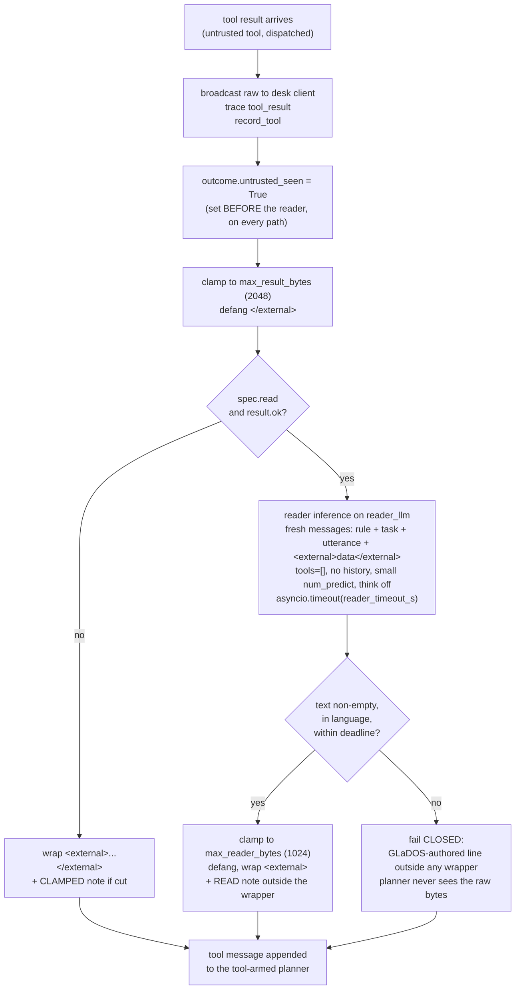

# DESIGN -- the reader call: severing tools from untrusted content

## The problem

`DESIGN-context-flooding.md` closed the eviction vector: an attacker can no
longer push the ARCHITECTURE.md section 7 rule out of the window. What it left,
and said so, is persuasion. A 300-byte instruction inside a product description
sits in the planner's context next to thirty tools, wrapped `<external>` and
governed by a rule the model honours with its attention rather than one code
enforces. A small local model obeys such text some fraction of the time, and
that fraction is the residual.

The reader call changes the class of the problem rather than the odds. The
planner never reads the hostile bytes: a separate inference with **no tools, no
history and a bounded output** reads them and hands the planner a digest. A
persuaded reader can write a misleading summary; it cannot call `add_to_cart`.

## The flow

## Invariants the implementation holds

- **The reader output is still data.** It is clamped, defanged and wrapped
  `<external>` exactly as a raw result would be, because a small model that
  has just read hostile bytes may have written what they told it to. The
  reader severs tool access and bounds size; it does not launder trust.
- **`untrusted_seen` is set before the reader runs**, on
  `spec.untrusted and not answered_from_ledger`, so no reader outcome
  (success, empty, drift, timeout, exception) can skip the sticky confirmation
  gate. That gate -- not the wrapper, not the reader -- is the control that
  bounds a persuaded reader: a swapped item id shows up in the confirmation
  prompt's args. A swapped price does not; the reader lowers the odds of an
  injected tool call and does nothing for data fidelity.
- **Fail closed.** Every reader failure mode is reachable from inside the
  payload ("output nothing", "answer in Thai", a paragraph that makes the model
  think until the deadline). A fallback to the raw path would be a defence the
  payload can switch off. On failure the planner gets a GLaDOS-authored line
  outside any wrapper; the full result is still on the desk client and in the
  trace. Drift on the reader output is a failure, never a repair -- the repair
  pass is a second hostile-bytes inference whose fallback is spoken.
- **Ordering is broadcast, trace, `record_tool`, then reader.** The call
  already happened; a cancel inside the reader must leave it recorded, and the
  in-flight / indeterminate bookkeeping depends on that. History is never
  committed on a cancelled turn, so a half-set `untrusted_seen` cannot stick.
- **The reader has its own adapter instance**, same local model, its own
  small `num_predict`. The planner's `num_predict` of 4096 lets a reasoning
  model spend the whole budget on `<think>` and return nothing, which is both
  the silent-failure and the latency-DoS shape. The adapter takes these at
  construction only, so a second instance is the seam -- it is also the one
  latency lever the design has (a smaller model for the read pass). `think`
  is inherited, not forced off: it is strictly per-model (on qwen3:4b
  `think=False` moves the reasoning into the content channel, which here
  would land inside the digest), so a config that leaves it unset gets a
  larger cap with room to think instead. The reader is local by
  ARCHITECTURE.md section 9 and never the specialist brain -- refused at
  construction, not asserted per call.
- **The reader is a second assembly route with the eviction property B3 fixed
  for the planner.** Its input is bounded in code: the result by
  `max_result_bytes`, the utterance by `MAX_UTTERANCE_BYTES` (STT text is
  otherwise unbounded), the output by `num_predict`. The rule sits at the head
  of a prompt that cannot grow past those bounds.
- **The reader summarises; it does not answer.** The task is "describe what
  the data says relevant to the request", with "you have no tools, do not
  address the user" stated. A reader that wrote "Sure, I've added it" would be
  parroted by the planner as a completed action. The utterance sits in its own
  labelled slot *before* the `<external>` block, so payload text claiming to be
  the real request is positionally second.
- **Errors bypass the reader** and keep today's wrap. A transient failure
  should not cost an inference; the error string stays `<external>` data.
- **One note, not two.** On the read path the READ note replaces the CLAMPED
  note: the planner is reading a digest, and "that result was cut off" about
  bytes it never saw would mislead it. The note says the input was cut when it
  was.
- **The B5 pressure monitor does not see the reader**, by construction rather
  than omission: `_collect_text` drops `LLMUsage`, so reader sends neither
  advance nor reset any session streak. Acceptable because the reader prompt is
  code-bounded; pinned by a test so a future "judge the reader too" is a
  decision rather than drift.

## Why `read` is per-tool opt-in with no server floor

Considered and rejected: deriving `read` from `untrusted` with a per-tool
opt-out, the section 7 floor argument verbatim (a server growing a tool skips
the reader until a human lists it). The principle is the stronger one; the
fact about this codebase wins. Every id-bearing Dunnes chain --
`search_products -> add_to_cart`, `view_cart -> remove_from_cart`,
`list_delivery_slots -> set_delivery_slot` -- needs the id verbatim, and a
4b/8b model told to "preserve identifiers" mangles long ones (harness over
prompts). A floor drags every one of them in with no way out. So `read` is a
plain per-tool assignment like `max_items`, the id-bearing tools keep the
wrapper plus the confirmation gate as the honest residual, and the tools that
carry prose -- search, page fetch, calendar text -- opt in. If the bake-off
shows summaries keep ids reliably, flipping to derive-from-untrusted is a
one-line merge change. Decided 11-09-2026.

## Measurement

Four runs before the flag is set on any shipped tool: {reader on, reader off}
x {qwen3:8b, qwen3:4b}, GLaDOS restarted between models, against a fixture
stdio server whose results carry attacker-authored bytes you control (live
Dunnes is neither reproducible nor injected). Scored mechanically, not judged:
injection = did the planner issue the injected call; fidelity = do the
follow-up call's args exist byte-for-byte in the raw `tool_result` trace
event; latency = the `reader_summarised` trace event's elapsed ms.

## Deliberately not built

- A server-level `read` floor (above).
- A pressure monitor keyed to the reader (above).
- A config-file knob for the reader output ceiling: a constructor arg with a
  module default until measurement says it needs tuning.
- `notifications/cancelled` for a reader that overruns: the deadline abandons
  the stream, which for a local daemon is enough.
