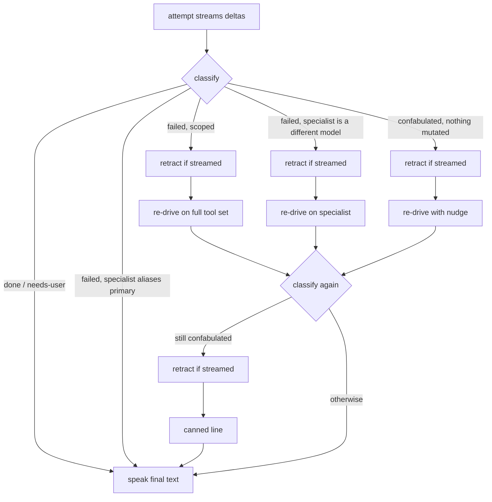

# Reply retraction and booking claims

## Problem

Prod trace, 07-10-2026, "book some slot for Sunday": the model called
`list_delivery_slots`, never `set_delivery_slot`, and replied "Slot booked:
Sunday 12:00-14:00 for EUR 9." Two faults compounded:

1. The claim check knew only cart verbs, so the false "booked" was not caught.
   The turn read as `failed` (a read ran, nothing landed) and escalated.
2. Prod's specialist aliases the primary, so escalation re-ran the same model
   from the same history and it said the same thing again. The desk kept the
   first bubble and opened a second one: the lie appeared twice.

## Design

- **Booking claims** (`turn_outcome.claimed_a_booking_it_did_not_make`): a
  sentence in a completion frame ("I booked", "slot booked", "it's reserved")
  is backed only by a landed call to a tool in `KNOWN_MONEY_TOOLS`. Any other
  landed write does not vouch for it ("add milk and book Sunday"). Listings
  ("fully booked", "booked up", "1 left", "available") and questions are not
  claims. An unbacked booking claim makes the turn `confabulated`, which takes
  the existing path: one nudged retry when nothing may have mutated, then the
  canned line.
- **`reply_retracted{session_id, reason}`**: broadcast before every re-drive
  (scope fallback, escalation, confabulation retry) and before a scrubbed
  reply's canned line, but only when this attempt streamed text. The desk and
  admin views strike through the live bubble and open a fresh one. Voice is
  unaffected: only the final text is spoken. Replaces the old appended
  "(Correction -- that had not happened when I said it.)" delta.
- **No same-model escalation**: `_should_escalate` refuses when the specialist
  is the primary instance (the server aliases them when the tags match).

## Review

Design panel 07-10-2026: clean-slate and reliability/protocol seats.
Adopted: booking-tool-only backing, completion-frame regex with listing
exclusions, retract-only-if-streamed, the new frame in `_OBSERVABLE_TYPES` and
`SESSION_FRAMES`. Deferred (user's choice): harness-rendered success text for
money tools, which would make a false "booked" impossible rather than caught,
and a per-attempt envelope (`attempt_start` / `attempt_end`) in place of the
retract event.
