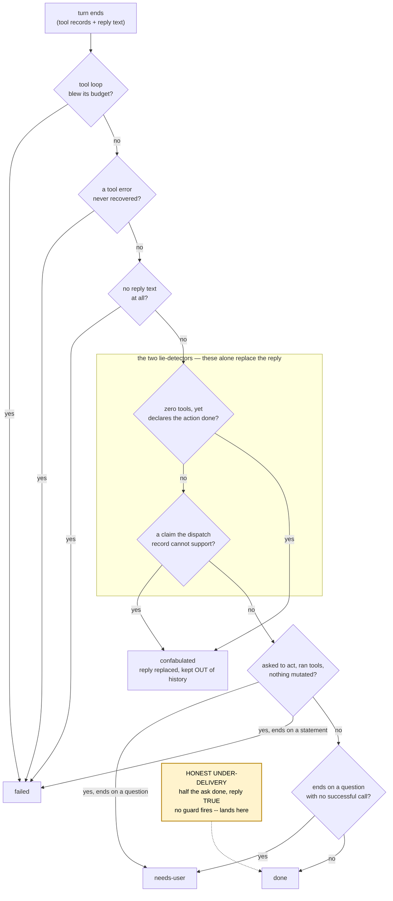

# DESIGN — the turn-outcome guards, and the gap left open

## The problem

A turn can end by doing what was asked, or by any of several failures that the
model narrates as success. `core/turn_outcome.py` classifies the turn from the
*observable dispatch record* rather than the model's self-report, because a
drifting local model narrates failure cheerfully and its narration is worthless
as a completion signal.

Four guards had accumulated there. This pass asked whether a fifth could catch
**honest under-delivery** — the model doing the first half of a compound
instruction and truthfully reporting what it found, without doing the second
half:

> **User:** "Show me what's in my cart and then remove the milk."
> **GLaDOS:** calls `view_cart`, says "Cart has 1 x 3L milk.", stops.
> The milk is never removed. Outcome: `done`.

The answer is that it cannot, with the signals available. That negative result
is the main content of this document — see *Deliberately not built*.

## The flow

The dotted edge is the point of the diagram: every guard above is *correctly*
silent on that input, and it arrives at `done` with nothing wrong that any of
them can see.

## Why each guard misses it

- **The claim check** needs a claim to corroborate. The reply is true.
- **The drift check** needs `action_intent`, which is anchored on a *leading*
  imperative — and the utterance opens with a read verb.
- **The confabulation retry** only fires on `confabulated`, which this is not.

## Ordering that matters

The two lie-detectors sit ahead of the drift check on purpose. A turn can be
both drifted *and* making a false claim, and only `confabulated` gets the reply
replaced and kept out of history; `failed` would leave "Milk removed from cart."
both spoken and committed, which is the poisoning the module exists to stop.

`claimed_a_change_it_did_not_make` never consults `action_intent`, which is why
it is the one that fires in practice — the reply is where the claim lives and
the dispatch record is ground truth, and neither depends on how the user phrased
the request.

## Invariants the implementation holds

1. **Fail open wherever it cannot judge.** A false positive replaces a correct
   spoken reply with a canned "no record of that" line *and* rewrites committed
   history — telling a user their shopping did not happen when it did is its
   own kind of lie. False negatives are cheap by comparison; the asymmetry is
   deliberate and every check is built to it.
2. **Claims are judged one at a time.** The check used to union every landed
   call's subjects and test the reply as a whole, so one true claim excused a
   false one beside it: "Eggs added and the milk removed." with only the add
   landed returned clean. Each claim clause is now judged alone.
3. **Claim verbs, cart-meta nouns and bare numbers never decide a claim.**
   They say *that* something changed, never *what*, and no tool argument ever
   contains them — so a claim naming only those has nothing checkable in it and
   declines to judge. Without this, "Added the eggs and updated your basket."
   accuses a turn that did exactly what it said.
4. **The `^` anchor on the action heuristic is the entire safety argument.**
   Whole utterances rarely *begin* with an action verb by accident. Everything
   the heuristic is allowed to do must preserve that property. The heuristic
   itself lives in `core/utterance.py` (`is_action_request`) — it reads the
   user's request, not the turn's record, and the organizer passes its answer
   in as `TurnRecord.action_intent`.
5. **Nothing replays after a successful mutation.** Every re-drive path checks
   it, or the side effect (cart write, checkout, send) fires twice.
6. **Four drives per utterance, enforced.** Base drive, capability fallback,
   specialist escalation, finish-the-job. `tests/test_drive_ceiling.py` pins it
   per brain — 2 on the primary, 2 on the specialist — so a fifth path cannot be
   added silently.

## Deliberately not built

**Detecting honest under-delivery.** Two mechanisms were designed, measured and
rejected on 25-08-2026.

**Splitting the utterance on coordinators** and testing each clause for action
intent. This was the obvious fix and it is the wrong one. The heuristic is safe
*because* of the `^` anchor; splitting manufactures new string-starts, and 11 of
the action verbs have an ordinary non-imperative reading in exactly that
position — "…and **change** is due on Friday", "…and **buy** one get one free
deals", "…and **order** should be under fifty euro". It trades a bounded miss
for an unbounded false positive, in the direction that costs most. It also does
not pay for itself: it left three of the five known misses unfixed, and no regex
separates "add milk **and** bread" (one action, conjoined object) from "show the
cart **and** remove the milk" (two clauses) — that distinction is
part-of-speech, not pattern.

Measured on 1372 logged utterances the split produced zero false positives, and
that number should not be trusted: the corpus is a scripted test suite, not
conversation, and contains almost none of the constructions above. It cannot
refute the finding; it only shows those phrasings are absent from data that was
never conversational.

**A per-clause satisfaction ledger**, requiring each action clause to have a
matching successful mutating call. Its matcher fails on the example that
motivated it: "take one of the **milks** off" against a call carrying
`"3L milk"` does not overlap (no stemming) and produces a *false accusation*,
while "remove the small milk" against a call that removed the large one *does*
overlap and is wrongly satisfied — too strict on morphology and too loose on
identity at once. It is also blind on every batch flow, where under-delivery is
most likely, because a list argument yields no subject words at all. Recovery
was unavailable to it regardless: in the partial case a mutation has already
landed, so invariant 5 forbids the replay.

**What would change the answer:** an operation axis on the tool contract
(add/remove/set, so a clause can be matched against what a call *did* and not
only what it was *about*), or naturalistic logged utterances to measure against
rather than a scripted suite. Neither exists today. Note the first widens the
adapter contract that ARCHITECTURE §6 keeps deliberately tiny, and that is an
invariant change to argue on its own terms, not a classifier tweak.

Until then the compound instruction is unguarded, and the honest reply reaches
the user with half the job done.

## Observed in production -- measured 26-08-2026, from a session of 25-08-2026

The gap above stopped being theoretical. `traces/desk_qcko_fc8007bd.jsonl`
holds 20 consecutive turns on `qwen3:4b` between 16:55 and 17:03 on
25-08-2026, driving the real Dunnes MCP subprocess. **Six of the 20 dispatched
no tools at all. All 20 classified `done`.**

The session was a scripted four-utterance loop (`start the dunnes browser` ->
`add milk to the cart` -> `Show me what's in my cart and then remove the
milk.` -> `what is in my cart`), so it is emphatically NOT the naturalistic
corpus named as an enabler above. It is the same kind of scripted data, and it
cannot settle the false-positive question the split was rejected on.

What it does settle is that the failure has two independent halves, and only
one of them is about the model.

| precedent in history for that utterance | turns | zero-tool | rate |
| --- | --- | --- | --- |
| none (first occurrence) | 4 | 0 | 0% |
| every previous answer used a tool call | 11 | 2 | 18% |
| at least one previous answer was text-only | 5 | 4 | 80% |

- **Onset is the model.** The first two zero-tool turns had only tool-call
  precedents in the window -- nothing in the history modelled the behaviour.
  18% is a property of `qwen3:4b` and is the figure a model bake-off can
  compare.
- **Contagion is the harness.** One text-only answer entering the eight-turn
  history window takes the rate from 18% to 80%. The window is ours, so this
  half follows any model we swap in and cannot be fixed by swapping one.
- **Invisibility is the `action_intent` gate**, exactly as *Why each guard
  misses it* predicted. Confirmed by running the predicate:
  `is_action_request("Show me what's in my cart and then remove the milk.")`
  is `False`, so `_confabulated` cannot fire however the reply reads.

**The gap is wider than this document assumed.** The motivating example is
honest under-delivery -- a true report of what was found. The observed turns
are worse. At 16:58:10 the model replied "Cart is empty." having dispatched
nothing, eight seconds after a `view_cart` returned `itemCount: 1` and with no
removal anywhere in the turn. That is a false assertion about external state,
not an honest partial answer, and the same `action_intent` gate hides it. A
zero-tool turn asserting checkable state is unverifiable regardless of whether
its verbs are in any claim vocabulary.

**The recovery machinery is not implicated.** `_finish_the_job` fired
correctly at 17:01:53 on `add milk to the cart` -- which *is* a leading
imperative -- injected its nudge, and the model dispatched the call five
seconds later. It never runs on the compound turns because classification has
already returned `done`.

**A vocabulary fix is still the wrong lever, for a new reason.** The seven
`claim-vocab` probe hits from this session are all "Cart is empty." or "Cart
has 1 x 3L milk.". Neither is a claim, and `_confabulated` never consulted
`_CLAIM_RE` in the first place -- promoting these would widen the claim check
that is not the gate, while leaving the gate untouched. It would also
manufacture false accusations on the turns that behaved, since "Cart is empty."
after a successful removal is true.

**What this changes for the parked decision:** nothing about the two enablers,
which are still absent. It adds a third avenue that neither depends on
splitting utterances nor on widening the adapter contract -- treating a
zero-tool turn that asserts checkable external state as unverifiable, on the
dispatch record alone, without reference to how the user phrased the request
(the property that already makes `claimed_a_change_it_did_not_make` the guard
that fires in practice). That is an invariant argument about what `done` may
mean, so it belongs to a design panel, not to a classifier tweak.

**Caveats.** One session, one model, 20 turns; the 4-of-5 and 2-of-11 cells are
small. This is a mechanism with supporting evidence, not a measured rate.
