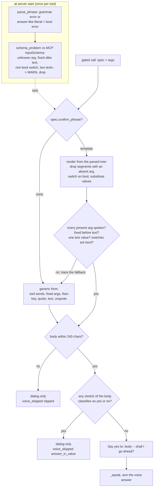
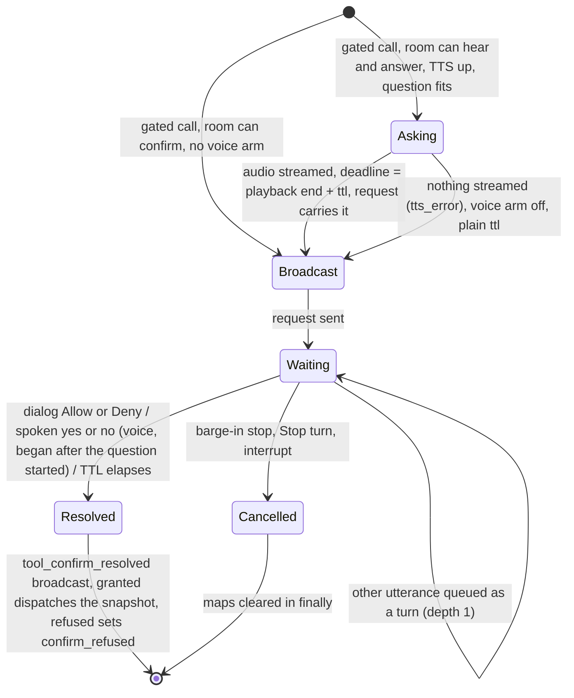

# DESIGN -- a spoken arm for the tool-confirmation gate

## The problem

A gated tool call (`Organizer._await_confirmation`) can today be answered only
by a `ui` client: the desk client's in-page dialog (`DESIGN-confirm-modal.md`,
landed 11-09-2026 as `9393185`). A room with a microphone and a loudspeaker but
no screen is refused in milliseconds (`_room_can_confirm` -> `tool_confirm_no_clients`).

That is the wrong arm to be the only one. The normal way to use GLaDOS is by
voice, with no console in reach, and `ARCHITECTURE.md` says so already:

- section 3: *"Permission gates are per-user. A confirm from one speaker does
  not authorise another. Confirms are spoken back to the room that initiated."*
- section 14 reserves screen-only approval for the **memory gate**, where a
  spoken "yes" would be a one-tap `--yes` on an injectable blob, and contrasts
  it with the per-turn `tool_confirm_request`, which it calls *"in-room and
  voice-grantable by design"*.

### Why cart writes are gated (get this right before relaxing anything)

Dunnes cart writes carry **no** `requires_confirmation`. `servers.example.toml`
declines it on purpose, for exactly the voice-UX reason this slice addresses.
What gates them in practice is the organizer's provenance arm:

    needs_confirm = spec.requires_confirmation
                    or (tc.from_text and spec.mutating)
                    or (outcome.untrusted_seen and spec.mutating)

A turn that has ingested `<external>` bytes (every Dunnes search result) and
then wants to mutate is asked, because a seller-authored `[TOOL_CALLS]` echoed
into a write is the injection ARCH section 7 exists to stop. So the gate is an
**injection boundary first**, and only incidentally the place where a person
also catches the model being wrong (an invented quantity, a removal under an
add request, a double add -- all seen live in the week of 07-09-2026; the write
guards in `DESIGN-write-guards.md` are the deterministic answer to those).

The `binding.role == "ui"` check in `handle_tool_confirm_response` stays. It
stops a mic or speaker *device* from forging a `ToolConfirmResponse` frame.

**Revisit clause (recorded 12-09-2026, at the user's request):** if the gate
proves too bothersome in ordinary voice use and breaks the shopping workflow,
the design of gating cart writes at all is to be revisited -- not just the
arm. Whoever revisits it must name the invariant being traded: relaxing the
`untrusted_seen and mutating` arm relaxes the section 7 injection boundary,
and the write guards bound *model* error, not injected calls. Candidate
relaxations, in order of how much they give up: a per-tool allow-list of
"small" writes (a single-pack add) that skip the gate; a
speak-and-proceed-unless-vetoed arm (the intercom pattern, section 3) for
additive writes only; dropping the untrusted-session arm for tools whose write
guards already bound the damage. None is built here. The trigger is observed
friction, not speculation.

### Roster findings folded in

The design roster (architect, security, concurrency) reviewed a first draft on
12-09-2026. What changed, and why:

- The draft claimed the spoken arm was "the server resolving its own request
  from its own ASR, no client frame involved". **False**: ASR runs on the
  client side of the audio path, and `UserText` frames are dispatched from any
  binding with no role check, so a mic token could type `"yes"` and grant --
  the hole the `ui`-only check closed. The intercept now accepts **voice
  source only** (set by the server's audio ingress, not by the client) and
  ignores typed text from every role, including `ui`: the desk has the dialog,
  whose arming and anti-race rules a typed "ok" would bypass.
- The draft bound the answer to the originating mic's `client_id`. Section 3
  dedups across several mics in one room and keeps the loudest per utterance,
  so the same person's "yes" can legitimately arrive from another mic; and
  the stated threat (a second person at the same mic) is not addressed by it.
  The answer is bound to the **room**, as the dialog is. A forged *audio* "yes"
  from a mic token is someone in the room saying it -- that is what a mic
  token is a credential for. Per-user consent stays deferred; note that this
  is a **reach regression** against the desk (where the answerer must be at
  the screen), not parity.
- Whisper emits "Okay." / "Sure." / "Yes." on near-silence. The yes-lexicon
  is narrowed to an explicit `yes`; the no-side stays broad (safe direction).
- The 30 s TTL was to start when `_speak` returned, which is when the last
  chunk is *sent* -- the mic then stays gated for the whole estimated
  playback, and a mid-turn question has no early release (the room speaker
  starts its drain watch on `done` only). The clock now starts from the gate
  horizon, as `_hold_veto_window` already does, and the question is capped
  hard.
- The dialog blocks Allow until every clipped value is expanded. A spoken
  twin that clips and still accepts "yes" hides the write. A question that
  would need clipping is **not asked by voice** (dialog only).
- A dialog answer landing during the question left the question playing and
  the room gated. Superseded later the same day: the request now goes out
  after the question, so nothing can answer during it.
- The intercept runs on the WS handler task, which has no trace handle and
  may run after the turn's trace is closed. It resolves the Future with a
  record; the worker task emits every trace event.
- A mic+speaker room with `tts is None` or a synth failure would hold the
  room's worker for the TTL hearing nothing: the voice arm needs working TTS
  and a question that actually streamed samples.
- `confirm_phrase` templates were dropped from v1 (user decision 12-09-2026):
  every real gate today fires on `untrusted_seen`, where all args must be
  spoken (a template naming the product but not the copied `product_id` is
  the attack), so a template would apply to nothing real.

## The plan

### Shape

One pending-confirm record on the Organizer (replacing two maps), one
intercept at utterance ingress, one deterministic renderer, one flag on
`TurnRecord`, one new protocol frame (`tool_confirm_resolved`). No LLM in the grant decision (memory
`harness-over-prompts`).

```
+---------------------+     ToolConfirmRequest (unchanged)     +------------+
|  _await_confirmation| -------------------------------------> | ui client  |
|  (room FIFO worker  |                                        |  dialog    |
|   is HELD here)     | --- _speak(question) ---> speaker/ui   +------------+
|                     |                                              |
|  fut: Future        | <---- handle_tool_confirm_response ----------+
|                     |
|                     | <---- _try_answer_confirm  <--- handle_user_text(source="voice")
+---------------------+        (yes / no lexicon)         <--- handle_audio_text
```

Both arms race on the same `Future`; the first valid answer wins, exactly as
two desk tabs do today. The intercept is registered for **every** confirm
(the dialog and a heard "yes" are interchangeable), so a desk room can be
answered by voice after reading the dialog.

### Who can hear and who can answer

Roles as they exist today (`mic`, `speaker`, `ui`; the desk client is `ui`
and both plays TTS and runs a mic pipeline):

- `_room_can_hear(room)`: a `speaker` or a `ui` binding.
- `_room_can_answer_by_voice(room)`: a `mic` or a `ui` binding.
- `_room_can_confirm(room)`: a `ui` binding, OR (can hear AND can answer by
  voice AND `self.tts is not None`).

One place, so the v7 capability-declaration migration (ARCH section 13) is
one edit. The `tool_confirm_no_clients` short-circuit keeps its meaning.

### The spoken question

`_await_confirmation` takes the `ToolSpec` (its one caller has it) and asks
aloud **before** the `ToolConfirmRequest` goes out, so the broadcast can carry
the deadline the server will actually enforce:

1. `render_confirm_question(spec.qualified, args)` -> `str | None`.
   `None` means the question would need clipping; then no voice arm, trace
   `tool_confirm_voice_skipped reason=clipped`.
2. `asked_at` = now; `_speak` streams the question and returns the loop time
   its audio is estimated to stop playing (`send_start + samples / rate +
   drain margin`), or `0.0` when nothing streamed (no TTS, synth error): then
   nobody heard a question, the voice arm is not armed, and the deadline is
   the plain `confirm_timeout_s` from now.
3. Otherwise `answers_after` = that playback end, or the room gate's
   `closed_until` if it is this session's and later (it adds the cooldown
   tail). The estimate cannot come from the gate alone: the desk plays audio
   as `ui`, and `_arm_gate_after_send` tracks only a `speaker`, so a desk
   room has no gate entry at all (observed live 12-09-2026: the dialog got
   the plain ttl and counted down through the question).
4. The deadline runs `confirm_timeout_s` from `answers_after`, and the
   broadcast's `ttl_s` is `deadline - now` -- the dialog and the server
   finish together. The dialog therefore appears about one synthesis late,
   as the audio starts. Nothing can answer before the broadcast, so there is
   no race between the question and an answer.
5. When the Future resolves -- either arm, or the deadline -- the room gets a
   `ToolConfirmResolved(request_id, granted, via: ui | voice | timeout)`.
   Before it existed the dialog closed on the next session frame, which
   behind a Selenium tool arrived 15 s later, with the guess "dropped -- the
   turn moved on" written over a confirm the user had spoken (observed
   12-09-2026). The client closes on the exact signal and writes the
   resolution into the transcript: "<tool> allowed by voice", "... denied on
   screen", "... timed out -- not sent".

The generic question: `"Say yes to: <server> <tool words>, <arg> <value>,
... -- shall I go ahead?"`. Fixed args (numbers, booleans, null) first, in
call order; free text last, each as `<key>, quote, <text>, unquote`, so a
product name cannot mimic a following `quantity one`. Nested values are JSON.
Text goes through the same printable-only / whitespace-collapse rule as the
intercom (`_spoken_message`, now shared). Limits: 8 args, 60 characters per
rendered value, key or tool name, 240 characters of question body; over any
of them -> `None`, nothing is ever clipped. The prefix names the one accepted
token at the FRONT (the lexicon is a bare "yes", so the sentence has to say
so) and the suffix ends on a word outside the lexicon: the desk's mic is not
gated server-side (`_arm_gate_after_send` pops the gate in a room with no
`speaker`), so a VAD split near the end of a "yes or no?" tail could
transcribe as "no?" and self-deny -- and "yes" anywhere near the tail would
self-grant. Numbers: a negative is "minus 1"; a run of five or more digits (a
product id) is read digit by digit in threes, "1 0 0, 8 0 6, 8 9 3", because
TTS otherwise reads it in the hundreds of millions and the listener cannot
check an id either way -- what they verify on an id-bearing tool is the verb
and the count, so those come first.

#### Per-tool sentences (`confirm_phrase`, landed 12-09-2026)

The generic form is what the user hears most, and it is an argument dump.
A tool's `servers.toml` overlay may carry a template that reads as a
sentence -- `add[ {quantity}] {repeat:more |}{query} to the cart` is heard
as "Say yes to: add 2 more milk to the cart -- shall I go ahead?". Design
roster 12-09-2026 (architect, security, UX; user sign-off on the two open
calls). The home is the overlay because core carries no server's field
names, and a template from the server itself would be the distrusted party
phrasing what the user approves.

The grammar is deliberately tiny and hand-parsed (`parse_phrase`, one
parser, cached, so boot and render see the same tree): `{arg}` speaks a
value; `{arg:A|B}` speaks A when a boolean is true and B when false, either
side may be empty; `[ ... ]` is dropped whole when an argument inside is
absent from the call. Anything else is literal. No nesting, no placeholder
twice, no empty `{}`, no segment without a placeholder: each is a boot
error (`ToolOverlay` validator), never a runtime fallback.

What survives from the generic form, and how:

- **Every argument the call carries is heard.** This was the objection that
  dropped templates from v1 ("a template naming the product but not the
  copied `product_id` is the attack"), and the coverage check is its direct
  answer: after substitution, any present key the template did not speak --
  including one inside a segment that was dropped for another reason -- sets
  the template aside for the generic form (`tool_confirm_phrase_fallback
  reason=unmentioned`, bounded keys). The model may OMIT an argument
  (`quantity`), and the segment vanishes; the harness never speaks a
  default it invented, and the dialog shows the raw call either way.
- **Fixed before free text**, now without `quote ... unquote`: the literal
  tail the author wrote is what follows the value, and the real number was
  already heard. At most one free-text value per template (two could mimic
  each other). A switch requires a real `bool` (a string `"false"` is
  `not_bool` -> fallback) and counts as fixed for ordering; a plain
  placeholder given a bool or null is `not_a_number` -> fallback, so "add
  yes more milk" is never heard. The free-text / fixed split is known from
  the MCP schema, so it is checked ONCE when the overlay meets the spec
  (`ServerEntry.apply_flags` -> `Phrase.schema_problem`): an unknown
  argument name, a fixed placeholder after free text, a switch on a
  non-boolean, a boolean without a switch, two free-text placeholders --
  each drops the template with a
  WARNING at server start, so a renamed Dunnes argument is loud rather than
  a robotic sentence nobody explains. A nullable type list (`["integer",
  "null"]`) is fixed; `anyOf`, `$ref`, a boolean-schema property or any
  other shape is free text (the ordering-strict side), and a schema the
  check cannot read at all drops the template with the same warning rather
  than failing boot. The per-call checks remain as the fail-safe for a value
  that contradicts the schema.
- **The body never contains a stretch that classifies as an answer** --
  both forms. An injected `query = "milk, yes please"` split by the VAD at
  the comma on the ungated desk mic would transcribe "Yes, please." and
  grant its own request. The rendered body is split at the pauses TTS makes
  (`, . ; : ! ?`, quotes, brackets and a spaced dash) and every run of
  words inside a stretch is classified; any hit makes the question
  dialog-only (`tool_confirm_voice_skipped reason=answer_in_value`). Checked
  on the body rather than the values because a key the model chose
  (`{"yes": "milk"}`), a JSON value, or a template literal can carry it too;
  a template whose own words -- literals or either side of a switch -- read
  as an answer is a boot error. Measured on grocery names, the hits are
  products whose name starts with "no" / "don't" ("No Added Sugar", "Don't
  Go Nuts"): each is a self-deny if split, so a screen tap for those is the
  right trade. The same rule found that the
  generic form spoke a boolean as "fresh yes," -- booleans are now "true" /
  "false", which the lexicon does not contain. Partly pre-existing: the old
  wrapper only put a non-lexicon token on each side of a value.
- **Same limits, same never-clip.** A templated body over 240 characters is
  dialog-only, NOT a generic fallback (which is longer still). Spacing is the
  renderer's problem, not the author's: doubled spaces and a space before a
  comma from an empty switch side are collapsed.

The decision on an empty switch side: `{repeat:more |}` speaks nothing for
`repeat=false`, which is a present argument going unheard. Kept, on the
user's call: the invariant guards against an INJECTED VALUE going unheard,
a boolean carries no payload, and the silence is the trusted config author
asserting the false case is the plain reading ("add 2 milk" is not a
repeat). A future rule of two may forbid it if a second switch wants it.



### The answer

`handle_audio_text` already checks barge-in, then the TTS mic gate, then calls
`handle_user_text(source="voice")`. The intercept sits at the top of
`handle_user_text`:

```
if source == "voice" and self._try_answer_confirm(binding, text, captured_at):
    return                      # consumed; not a turn, not a transcript
```

`_try_answer_confirm`:

- No pending confirm for the room, or its voice arm not armed, or the Future
  already done -> `False` (falls through to a normal turn; the "already done"
  case is the tick between the timeout and the `finally`).
- `classify_confirm_answer(text)` (in `core/utterance.py`, anchored
  whole-utterance, politeness lead-in, Whisper's trailing period tolerated):
  `yes` -> `"yes"`, `yes please` / `please yes` / `yes go ahead` -> `"yes"`;
  `no` / `nope` / `nah` / `don't` / `do not` / `no thanks` / `negative` ->
  `"no"`; anything else -> `None`. **Not** in the yes side: ok, okay, sure,
  correct, do it, go ahead alone, confirm -- the Whisper-on-silence set.
- `None` -> `False`, falls through: the utterance is queued as a normal turn
  behind the held one **with `max_depth=1`** while a confirm is pending, so
  a burst of "what?", "hello?" cannot pile up an LLM turn each; the first is
  kept, later ones are refused by the queue (logged). The confirm keeps
  waiting. A non-answer is not a deny -- the server never treats an
  unrelated frame as one, and a silent refusal after "what did you say?" is
  the worse failure.
- `captured_at < asked_at` -> the answer began before the question did
  (STT latency lets a transcript of something said two seconds earlier land
  now) -> `False`, logged. An answer that began **during** the question
  counts: people answer as soon as they have heard the item, and on the desk
  (browser AEC, no server gate) that is the normal case. In a mic+speaker
  room the pre-existing TTS feedback gate still drops anything captured
  during playback -- that gate cannot tell the user from GLaDOS's echo, and
  its fix is echo cancellation on the room clients, not this slice.
- Only a `mic` or `ui` binding may answer: an audio pipeline is built for
  every role, so a `speaker` credential streaming audio would otherwise be a
  voice.
- `yeah` is deliberately outside the yes side; expect friction, widen only
  with evidence.
- Otherwise `fut.set_result(_VoiceAnswer(granted, client_id, text))` and
  `True`.

Barge-in (`stop`, `cancel`, ...) is checked first in `handle_audio_text` and
cancels the whole turn, which cancels `_await_confirmation` through its
`finally`. That is a deny, consistent with the dialog's *Stop turn* button.

A drop by the TTS mic gate while a confirm is pending is logged at INFO with
the request id, so a live-test "I said yes and nothing happened" is
diagnosable (the gate runs on the handler task; no trace handle there).

### State

`_PendingConfirm(request_id, room_id, fut, session_id, voice_armed=False,
answers_after=0.0)`, stored in `_pending_confirms: dict[request_id, record]`
with `_confirm_by_room: dict[room_id, record]` as the second index (a room
runs one turn and a turn awaits one confirm at a time). Both registered and
both popped in the one `try/finally`.

`fut: asyncio.Future[bool | _VoiceAnswer]`. The dialog path sets a `bool`; the
worker, after `wait_for`, traces `tool_confirm_voice` when the result is a
`_VoiceAnswer` and reduces it to `granted`.

### Escalation on a refused confirm (landed in this slice)

Observed 11-09-2026 and listed as deferred in `DESIGN-confirm-modal.md`: a
denied or timed-out confirm leaves the turn with no recorded write, so the
goal check classifies it `failed` (drift, or confabulation on a zero-tool
turn) and the specialist re-drives the request and asks again. With a spoken
arm that doubles the spoken cost and closes the mic twice.

`TurnRecord.confirm_refused: bool`, set by the organizer on a deny or
timeout. `classify` returns `"needs-user"` for such a turn -- the user
stopped it deliberately -- checked after the loop/error checks and only when
the reply does not claim the change happened (`claimed_a_change_it_did_not_make`
still wins, so a model that says "added!" after a deny is still caught). And
independently of what `classify` says (an earlier unrecovered error keeps the
record `failed`), both re-drive predicates -- `_should_escalate` and the
scoped-capability full-set re-drive -- refuse a `confirm_refused` turn. No
escalation, no confabulation retry, no reply replacement.

### Trace events

- `tool_confirm_spoken` (`request_id`, `question`) before speaking.
- `tool_confirm_voice_skipped` (`request_id`, `reason`: `clipped` |
  `no_audio`) when the voice arm is not armed for a room that could confirm
  (not emitted when the dialog answered during the question).
- `tool_confirm_voice` (`request_id`, `verdict`, `client_id`, `text`) emitted
  by the worker when a spoken answer resolved the request, before the
  existing `tool_confirm_response`.
- Existing `tool_confirm_request` / `tool_confirm_response` /
  `tool_confirm_timeout` / `tool_confirm_no_clients` unchanged.

Trace events land in `traces/` only, which already carries `tool_call.args`
and every transcript, so the two new events add nothing that was not there
(section 9); the admin observe channel forwards protocol frames, never trace
events. A consumed
"yes" is never broadcast as a `UserTranscript` and never enters history.

### What does not change

The `ui` role check in `handle_tool_confirm_response`; the args snapshot and
`model_copy` after a grant; the dialog and `confirm_state.ts` rules -- note
the dialog's session-frame drop list excludes `tts_chunk` on purpose, and the
spoken question depends on that staying so; the write guards.

## Lifecycle of one request



## Failure modes considered

- **The user answers over the question.** On the desk it counts (no server
  gate). In a mic+speaker room it is dropped by the TTS feedback gate and
  logged with the request id; the user repeats after the question ends.
  Only an answer that began before the question started is refused as not
  an answer to it.
- **Two gated calls in one turn.** Sequential; each asks. Same as the dialog.
- **Whisper mishears.** "know" is not in the lexicon -> non-answer -> queued
  turn (bounded), confirm still waits. "yes." is tolerated. Whisper's silence
  hallucinations ("Okay.", "Thank you.", "Sure.") are outside the yes side.
  A hallucinated bare "Yes." remains possible and is the residual risk of any
  spoken arm; the per-user work and a speech-energy check on the VAD segment
  are the mitigations, both deferred.
- **The speaker drops mid-question.** Samples were streamed; the gate arms
  from them; the TTL runs; nobody hears. Times out as today.
- **A second person in the room says "yes".** Granted. Documented per-user
  gap and reach regression against the desk.
- **GLaDOS's own question in a transcript.** Gated at capture time; and
  "... yes or no" is not an anchored yes.
- **Turn cancelled during the question.** The speak task is cancelled with
  the worker; `_arm_gate_after_send` sees `cancelled` and arms the short
  cooldown; the `finally` clears both indexes.
- **Late `playback_done` from the previous turn** under a reused session id
  could shorten the question's `draining` gate. Pre-existing for replies;
  noted, not fixed here.

## Deferred

- Speaker identification for true per-user consent (ARCH section 3); a
  speech-energy floor on the VAD segment before a verdict counts.
- A short re-ask ("yes or no?") on the first non-answer.
- **Learned affirmatives (user direction, 12-09-2026):** when GLaDOS memory
  is built, the per-user way of saying yes ("yeah", "yep", "go on") should
  widen the lexicon from memory rather than from a hardcoded table. The
  shape must stay the same as today: memory feeds the DETERMINISTIC matcher
  (a per-user alias table, hash-gated per ARCH section 14), never a model
  judging "did that sound like a yes" at grant time.
- ~~Per-tool spoken templates (`confirm_phrase`)~~ -- landed 12-09-2026, see
  "Per-tool sentences" above.
- Everything listed under *Deferred* in `DESIGN-confirm-modal.md`.

## Verification

Unit (pytest):

1. `classify_confirm_answer`: yes / no / non-answer table incl. lead-ins,
   trailing period, "yes please", "no thanks", "yes or no" (None), "I know"
   (None), "yesterday" (None), "okay" (None), "sure" (None), "yes yes" (yes).
2. `render_confirm_question`: fixed args before text, quote/unquote wrapping,
   nested JSON, control characters dropped, 61-char value -> None, 9 args ->
   None, long body -> None; the rendered question never classifies as an
   answer.
3. `_room_can_confirm`: ui; mic+speaker with TTS; mic+speaker without TTS
   (False); mic only (False); speaker only (False); nothing (False).
4. Organizer with a fake TTS, mic+speaker room: spoken "yes" grants and traces
   `tool_confirm_voice`; "no" denies; typed "yes" (`source="text"`) is a
   normal turn; "yes" from another room is a normal turn there; a non-answer
   is queued and the confirm still times out; a second non-answer is refused
   by the queue; `captured_at` before `answers_after` is a normal turn; the
   dialog answering during the question cancels the speak task; the TTL is
   measured from the gate horizon; cancellation clears both indexes; a TTS
   that yields nothing leaves the voice arm off and the plain TTL.
5. `classify`: `confirm_refused` -> `needs-user`; with a false claim of
   change -> still `confabulated`; `_should_escalate` False on a refused
   turn.

Live (with the user; mic+speaker room, and the desk): "Use the toy_stdio
roll_dice tool to roll 3d6" -> hear the question -> "yes" -> rolls; "no";
something unrelated; silence; answer by voice with the desk tab open and
check the dialog closes; deny and confirm there is no second prompt.
