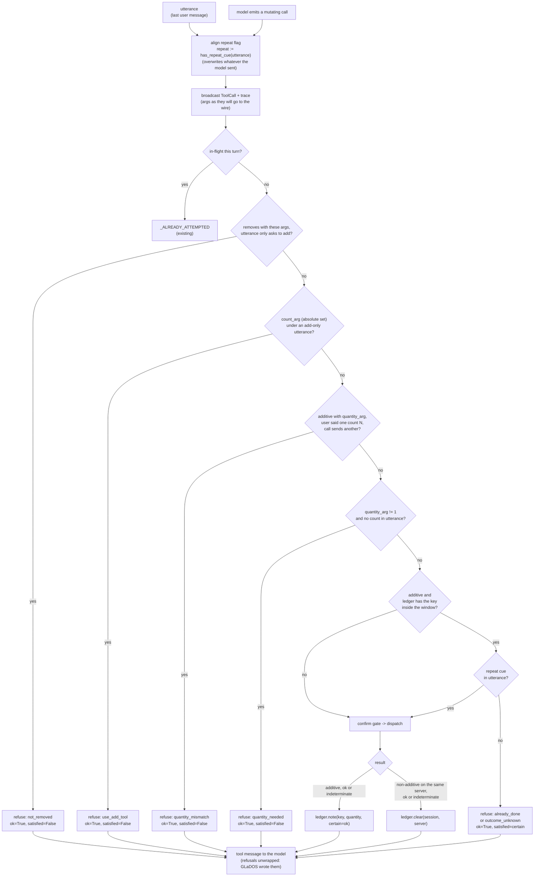

# DESIGN -- write guards: a count the user never said, and an add that already landed

## The problem

Observed 11-09-2026 on `ministral3:8b-instruct` against the live Dunnes server.
Turn 1, "add tomatoes to the cart": `add_to_cart_by_name(query="tomatoes")`,
one pack added. Turn 2, the same sentence: the model called
`remove_from_cart(productId=...)` and then
`add_to_cart_by_name(query="tomatoes", quantity=4)`. Net cart: four packs, and
the four came from nowhere.

Neither existing guard could fire. The Dunnes server refuses an *identical*
additive write inside two minutes, but the model rewrote the arguments, so the
second write was not identical. The organizer's in-flight ledger
(`DESIGN-dispatch-cancellation.md`) refuses a re-issue *within a turn*; these
were two turns. And the project rule stands: small local models follow prompts
unreliably, so the fix is code in the harness, not a line in the system prompt.

Five guards (the third added after a re-run, invariant 10; the fourth split
out of guard 1, invariant 11; the fifth for a count the model dropped,
invariant 12), all in
`Organizer._run_tool_calls`, all ahead of the confirmation gate (like the in-flight ledger: a call that is not being sent must not prompt
the room), and all standing down when `reply_language` is not English, because
the cue tables cannot read anything else.

## The flow

Key = `(server.tool, canonical args)` with the tool's `quantity_arg` and the
server's `repeat` dropped, string values lowercased and whitespace-collapsed.
The in-flight ledger uses the same canonicaliser with nothing dropped.

## Invariants the implementation holds

1. **Guard 1 runs before guard 2.** Otherwise the ledger answers "already done"
   to `add(tomatoes, quantity=4)`, the `satisfied` record excuses the model's
   "added four", and the invented count is laundered into a true claim.

2. **`repeat` is the user's word, never the model's.** Every call whose schema
   carries `repeat` has it overwritten from `has_repeat_cue(utterance)`. A model
   that sets `repeat: true` on its own would otherwise defeat both this ledger
   (a new key) and the server's own identical-write refusal. Rewritten before
   the `ToolCall` broadcast and the trace event, so the confirm dialog and
   `traces/` show the call that went to the wire.

3. **The ledger holds only harness-authored facts**: tool, the model's
   arguments, the clock, the quantity, and whether the result was certain.
   Never the server's result content. That is what lets a refusal be delivered
   outside any `<external>` wrapper (section 7): GLaDOS wrote every byte of it.

4. **A refusal is `ok=True`, `mutating=False`.** `ok=True` like the intercom
   refusal, so the turn is not `failed` and does not escalate to the specialist
   (which would re-issue the same call into the same refusal). `mutating=False`
   because nothing changed this turn, so `may_have_mutated` and the recheck
   escape hatch stay truthful. The goal-check reads a third flag instead:
   `ToolRecord.satisfied`, set only for a *certain* `already_done`, counts as
   landed in `_has_successful_mutation` and in the claim check's `landed`
   list. On the record, not the turn, so one satisfied tomato call cannot
   excuse "and I added milk too".

5. **`quantity_needed` meets nothing.** `satisfied=False`: the goal-check sees
   an action turn with no landed mutation, so a model that asks "how many?"
   classifies `needs-user` and one that asserts "added four" is caught by the
   claim check exactly as before.

6. **Any non-additive write on the same server clears that server's entries
   for the session.** A remove is by `productId`, an add by free-text `query`;
   they cannot be matched, and after a remove the ledger's "already in the
   cart" may be false. Clearing is coarse and fails open toward the server's
   own refusal. Scoped to the server because `room.speak_into` and a timer are
   mutating too and say nothing about the cart -- an intercom message between
   two adds must not re-arm the duplicate. A call that answered `ok` without
   taking effect (the intercom's refusal) clears nothing. Today's sequence now
   plays: the remove clears, the `quantity=4` add is refused by guard 1, and a
   later plain "add tomatoes" adds one.

7. **A timed-out add is ledgered too**, `certain=False`, and answered
   `outcome_unknown` ("may already be in the cart; check") rather than
   `already_done`. Stamped when the result arrives, not when the call was
   sent -- Dunnes timeouts are 400 s, longer than the window.

8. **`additive` and `quantity_arg` are overlay fields** (`servers.toml`), so
   no server's tool or argument names live in code. Set on the four Dunnes
   adds; `quantity_arg` only on the two with a count, because for
   `set_*`/`adjust_*` a 1 or a -1 is a real request.

9. **Bounded like `_history`**: per session, LRU-evicted with it, pruned to
   the window on every touch, dropped on start-over.

10. **Guard 3: an add request does not remove** (added 11-09-2026, after the
    post-fix re-run). Turn 2 opened with `remove_from_cart` again; that
    non-additive write cleared the ledger (invariant 6), the re-add went to the
    wire, the SERVER refused it as a duplicate, and the cart ended empty while
    GLaDOS said "already in the cart". Guard 3 runs first: when the utterance
    opens with add / put / buy / order (`utterance.is_add_request`, anchored
    like `is_action_request`) and carries no removal cue anywhere, a write
    flagged `removes` is refused with `not_removed`, `ok=True`,
    `satisfied=False`. Being a local answer it clears nothing, so the re-add
    meets the ledger and "already in the cart" is true. Naming the argument
    makes the flag conditional: `delta_arg` on `adjust_*` removes only at
    `delta <= 0`, so "add one more milk" via `adjust(delta=1)` still goes
    through; `count_arg` on `set_*` removes only at `quantity <= 0`. An
    argument that is not a number counts as removing.

11. **An absolute set never answers an add** (widened 12-09-2026 from the
    count-free case). "Add" is relative and a `count_arg` set is absolute;
    bridging them needs the cart's current count, which the harness cannot
    see. So `set_cart_quantity_by_name(milk, 1)` under "add milk" takes two out
    of three, and `set(milk, 2)` under "add two milk" takes one out just the
    same -- a count in the utterance does not license the set, it only says
    what to pass to the add tool. Refused with `use_add_tool`, `satisfied=False`,
    after guard 3 (a set to zero is reported as the removal it is) and before
    guard 1. Only when the utterance is add-only: "remove the milk" and "set
    the milk to two" carry removal cues, so their sets go through. A
    `delta_arg` tool is exempt: a delta of one is "add one", not a guess. The
    cost is one round-trip when the model reaches for the set first.

12. **A count the user said must reach the call** (added 12-09-2026, bake-off
    T10). "Add two more milks" became `add_to_cart_by_name(milk, repeat=true)`
    with no quantity: one carton went in and the turn was `done`. Guard 1 only
    refuses a count the user never said. `utterance.spoken_count` reads a count
    ONLY directly after the add verb ("add [another|more] two milks", "put 4
    yoghurts in"); an additive `quantity_arg` call sending any other count --
    absent counts as one -- is refused with `quantity_mismatch`,
    `satisfied=False`. Three limits, all from the code duck, which found the first
    version reading "a 6 pack", "Heinz 57" and "2% milk" as counts and the note
    then ORDERING the model to multiply -- a real over-add from a correct call:
    - The parse stands down on anything it cannot tie to the call: a number
      not right after the verb, a size or pack word after it ("2 litres", "6
      pack", "12 inch", "dozen"), a hyphen or percent, and any list or compound
      ("and", commas, "then", "with", "for", "by", "each", "per").
    - The note names the number but does not order it: count, or part of the
      product, the model decides.
    - A nudge, not a wall (`TurnRecord.quantity_nudged`, keyed on the call
      minus its quantity). The same call with the SAME count, re-sent in a
      LATER pass, goes through (`quantity_mismatch_overridden`): that pass read
      the note and kept its count. Two identical calls in one pass have read
      nothing and are both refused; a different wrong count is judged afresh.
      At most two refusals per tool per turn, so a model varying the query
      ("milk", "whole milk") cannot walk the turn to its pass cap. A wrong parse
      costs a round-trip; a model that ignores the note still under-adds, and the
      override adds no note of its own, because it cannot tell a real drop from
      a pack size and "you asked for 6" after "a 6 pack" would mislead.
    Refused, not rewritten: unlike `repeat` (a flag the ledger and the server
    backstop), a wrong quantity is money with nothing downstream to catch it.
    Accepted gaps: "add 12 eggs" means twelve items here, whatever the shop
    sells; a model that ignores the note twice still under-adds, as before.
    `adjust_*` (`delta_arg`) is not additive and is not checked.

## Cue tables

`utterance.has_quantity_cue`: digits and number words (one..twenty, tens,
hundred, dozen) plus vague counts (couple, few, some, more, another, all...).
Word-bounded -- "one" lives inside "onion" and "phone". A digit glued to a unit
("1L", "7up") does not match and is not meant to: it names a product.
`has_repeat_cue`: another, again, more, extra, second, additional, further.
"more" is both, deliberately: "add more tomatoes" forwards with `repeat=true`
and lets the model's count through -- the user asked for more.
`is_add_request`: leading add / put / buy / order, and none of remove, delete,
take, replace, instead, swap, change, switch, less, fewer, reduce, drop, out,
off, only, down, minus, without, rid, zero, none, empty, clear, cancel, undo,
set, update, make, no, not, ditch, scrap, forget, and the digit 0. Broad on
purpose: a missed cue refuses a remove the user wanted; a false cue only falls
back to the behaviour before guard 3.

## Measurement

Not yet measured against a live model beyond the observed failure. What the
unit tests prove (`tests/test_write_guards.py`): the same add next turn is
refused; the model's `repeat` is overwritten; a repeat cue forwards with
`repeat=true`; a remove clears; a timeout answers `outcome_unknown`; the window
expires; non-English stands down; a refusal never sets `untrusted_seen`.
What they cannot: whether the model asks "how many" after `quantity_needed`,
or re-plans around `already_done` by switching to `add_to_cart(productId)`.

## Deliberately not built

- **Skipping escalation after a guard refusal.** A turn whose only call was
  refused meets no goal, so it is `failed` and escalates; the specialist
  re-issuing the same call is refused again (tested). Considered 12-09-2026
  and kept: the specialist ships aliased to the primary
  (`local_smart_model = ""`), so escalation is a cold re-roll that sees the
  request without the failed attempt, and it can pick the add tool or ask
  "how many?" where the first attempt did neither. Nothing mutated, so the
  price is latency only -- unlike `confirm_refused`, where the re-roll would
  ask the room the same question twice.
- **A harness-authored reply for "removed, then the shop refused the re-add".**
  Planned alongside guard 3, dropped: guard 3 removes the path that produced
  it under an add-only utterance, and detecting the case means matching the
  server's own refusal text -- untrusted content steering a control decision.

- **Cross-tool re-add.** `add_to_cart_by_name(query)` then
  `add_to_cart(productId)` for the same product are different keys. Guard 1
  still catches the invented count; the rest is the server's refusal.
- **Account-scoped ledger.** Sessions are per `(room, speaker)`; the cart is
  per account. "Add tomatoes" from the desk and again from the kitchen mic is
  not caught.
- **Window measured from the utterance.** It is measured from the check. A
  long Selenium call inside turn 2 could push past it.
- **Per-language cue tables.** Off-English both guards stand down.
- **Reading the count from an earlier turn.** The cue check reads only the
  last user message. "Shall I add four for the recipe?" / "yes" /
  `add(quantity=4)` is refused and costs one round-trip ("how many?" /
  "four") on a well-behaved dialogue. Scanning history for the count would
  let a scraped product name supply it, so the utterance stays the only
  source.
