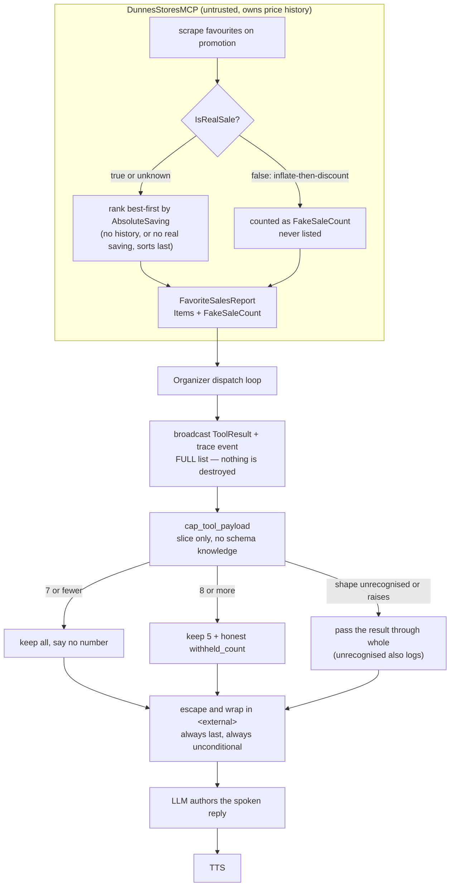

# DESIGN — spoken-length cap on tool results

## The problem

A voice reply is read start to finish. The listener cannot skim, cannot jump to
the interesting line, and cannot go back. So when `scan_favorites_for_sales`
returns a dozen items on promotion, GLaDOS speaks a dozen items — and the user
has to sit through all of them to learn there were two worth hearing.

Capping the reply by asking the model for brevity does not work: small local
models follow such instructions unreliably, and the failure is silent. Capping
the PAYLOAD is deterministic — the model cannot name an item it never received.

## Where the work is split, and why

Two repos, one seam each.

**The Dunnes MCP server ranks and filters.** It owns the price history, so it is
the only party that can compute a saving or judge a promotion. It sorts
best-first by `AbsoluteSaving` (euro off the historical median), drops items
that fail the `IsRealSale` test, and reports how many it dropped as
`FakeSaleCount`. It returns the FULL ranked list.

**GLaDOS slices.** It takes the first N and counts the rest. It reads no field
of the Dunnes schema — only "is this a list, and how long is it". This is the
line `ARCHITECTURE.md` §7 draws: GLaDOS does not parse another repo's payload
in the code path that handles hostile bytes.

The alternative — capping inside the .NET server — was rejected because the
withheld items would then never reach GLaDOS at all, and the desk client and
`traces/` would lose data they show today.

## Why euro, not percent

A third off a yoghurt is small change next to a tenth off a joint of beef.
Percent flatters cheap items; the listener cares about money. The saving is the
SORT KEY only — it is never spoken, because saying "down from eight, saving two"
after every item roughly triples the length and reintroduces the problem the cap
exists to solve.

## The flow

## Invariants the implementation holds

1. **The cap runs downstream of the broadcast and the trace.** It narrows what
   is SPOKEN, never what is recorded. The full list stays in the desk client and
   in `traces/`, so the withholding is recoverable by the user.
2. **The `<external>` escape and wrap stay terminal and unconditional.** The cap
   rebuilds the payload, so the defang is applied to the cap's output, not to
   the bytes the server sent.
3. **The cap emits JSON values, never prose.** A scraped name inside a JSON
   string literal is a quoted datum; the same name formatted into a sentence is
   free-running text sitting where a sentence goes. The LLM writes the prose.
4. **`withheld_count` is derived from the list actually sliced.** Computing it
   from a raw total would offer items the server already filtered out — a
   confabulation authored by the harness itself.
5. **The cap never fails a turn.** Any unexpected shape or exception passes the
   result through untouched. The tolerable failure is today's long list; a
   silent "nothing found" is not, because it reads exactly like the truth.
6. **GLaDOS never offers what it cannot deliver.** The withheld items are not
   retained, so the reply states how many more exist and stops. The system
   prompt says so explicitly, because a bare `withheld_count` the model has to
   interpret is either ignored or read aloud as a key name.

## What the ranking cannot do

There is no purchase-frequency data anywhere in the Dunnes server — only an
`IsPastPurchase` boolean scraped from a badge. "The five we buy most" is not
computable today. The favourites list is itself the coarse frequency filter,
since the scan only ever looks at items the user chose to favourite.

## Deliberately not built

**Delivering the withheld remainder.** GLaDOS says how many more there are and
stops; "yes, tell me the rest" is not yet answerable. A remainder cache was
built and then removed, because retaining items with no path to speak them is a
store that can only ever go stale — and an offer the system cannot honour is the
confabulation shape this project has logged repeatedly.

When it is built, the design is already argued: cache the remainder rather than
re-scraping (`scan_favorites_for_sales` has a 35 s timeout and there is one
worker per room, so "yes" would buy 35 seconds of dead air and block every later
utterance in that room), key it by session, bound its lifetime to the same
commit decision as the conversation history, and drop it on barge-in — GLaDOS
cannot know which items were actually heard before an interruption.
